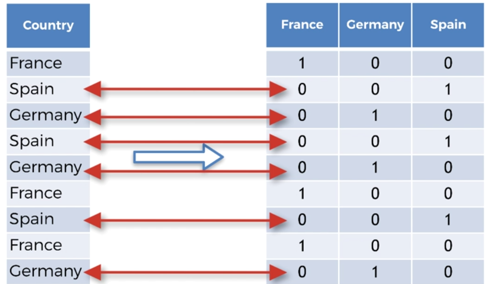
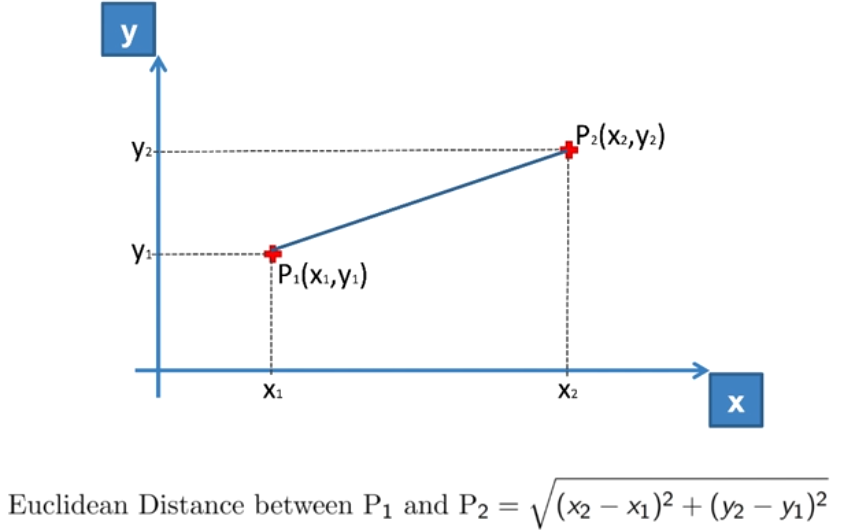
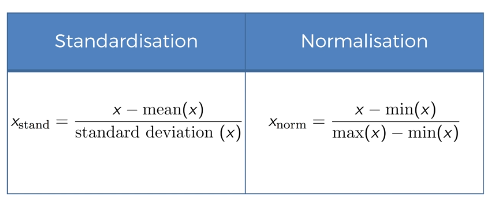

# ML - Data Processing

## Data Processing Template
Importing librairies


```python
import numpy as np
import matplotlib.pyplot as plt
import pandas as pd

```

Importing the dataset


```python
dataset = pd.read_csv('Data.csv')
dataset
```


<div>
<style scoped>
    .dataframe tbody tr th:only-of-type {
        vertical-align: middle;
    }

    .dataframe tbody tr th {
        vertical-align: top;
    }

    .dataframe thead th {
        text-align: right;
    }
</style>
<table border="1" class="dataframe">
  <thead>
    <tr style="text-align: right;">
      <th></th>
      <th>Country</th>
      <th>Age</th>
      <th>Salary</th>
      <th>Purchased</th>
    </tr>
  </thead>
  <tbody>
    <tr>
      <th>0</th>
      <td>France</td>
      <td>44.0</td>
      <td>72000.0</td>
      <td>No</td>
    </tr>
    <tr>
      <th>1</th>
      <td>Spain</td>
      <td>27.0</td>
      <td>48000.0</td>
      <td>Yes</td>
    </tr>
    <tr>
      <th>2</th>
      <td>Germany</td>
      <td>30.0</td>
      <td>54000.0</td>
      <td>No</td>
    </tr>
    <tr>
      <th>3</th>
      <td>Spain</td>
      <td>38.0</td>
      <td>61000.0</td>
      <td>No</td>
    </tr>
    <tr>
      <th>4</th>
      <td>Germany</td>
      <td>40.0</td>
      <td>NaN</td>
      <td>Yes</td>
    </tr>
    <tr>
      <th>5</th>
      <td>France</td>
      <td>35.0</td>
      <td>58000.0</td>
      <td>Yes</td>
    </tr>
    <tr>
      <th>6</th>
      <td>Spain</td>
      <td>NaN</td>
      <td>52000.0</td>
      <td>No</td>
    </tr>
    <tr>
      <th>7</th>
      <td>France</td>
      <td>48.0</td>
      <td>79000.0</td>
      <td>Yes</td>
    </tr>
    <tr>
      <th>8</th>
      <td>Germany</td>
      <td>50.0</td>
      <td>83000.0</td>
      <td>No</td>
    </tr>
    <tr>
      <th>9</th>
      <td>France</td>
      <td>37.0</td>
      <td>67000.0</td>
      <td>Yes</td>
    </tr>
  </tbody>
</table>
</div>


We have our dataset but we need to distinguish the matrix of features and the dependent variable vector.

So we are going to create a matrix of features : the matrix of the 3 independent variables (Country, Age, Salary) 

We are going to put in a variable X all the observations (3 columns):
- iloc[:, :-1] will take every columns except the last one -> __iloc[lines, columns]__ and __":"__ represent a range. 
- values method will transform our dataframe to an array


```python
X = dataset.iloc[:, :-1].values
X
```


    array([['France', 44.0, 72000.0],
           ['Spain', 27.0, 48000.0],
           ['Germany', 30.0, 54000.0],
           ['Spain', 38.0, 61000.0],
           ['Germany', 40.0, nan],
           ['France', 35.0, 58000.0],
           ['Spain', nan, 52000.0],
           ['France', 48.0, 79000.0],
           ['Germany', 50.0, 83000.0],
           ['France', 37.0, 67000.0]], dtype=object)


Now we are going to create the dependent variable vector "Y" only get the last column (index = 3)


```python
Y = dataset.iloc[:, 3].values
Y
```


    array(['No', 'Yes', 'No', 'No', 'Yes', 'Yes', 'No', 'Yes', 'No', 'Yes'], dtype=object)


## Missing Data 
If we look at our dataset we see that we have missing data (NaN values).

The first idea to handle this is to replace missing data by the __mean__ of all the values in each column.

To do this we are going to use the __Imputer__ class of the __scikit learn__ library: http://scikit-learn.org/stable/modules/generated/sklearn.preprocessing.Imputer.html


```python
from sklearn.preprocessing import Imputer

# Creating the object
imputer = Imputer(missing_values = 'NaN', strategy = 'mean', axis = 0)

# Fitting our imputer with columns in the 1:3 (upper bound excluded) range (Age, Salary) -> where there is missing data
imputer = imputer.fit(X[:, 1:3])

# Apply our imputer to the matrix
X[:, 1:3] = imputer.transform(X[:, 1:3])
X
```


    array([['France', 44.0, 72000.0],
           ['Spain', 27.0, 48000.0],
           ['Germany', 30.0, 54000.0],
           ['Spain', 38.0, 61000.0],
           ['Germany', 40.0, 63777.77777777778],
           ['France', 35.0, 58000.0],
           ['Spain', 38.77777777777778, 52000.0],
           ['France', 48.0, 79000.0],
           ['Germany', 50.0, 83000.0],
           ['France', 37.0, 67000.0]], dtype=object)


## Categorical data
How to encode categorical data.

In our dataset we have to categorical variables : Country and Purchased (they contain categories)

The problem is that we can't keep __text__ variables in the equations because we only want numbers. So we need to encode them into __numbers__.

To do this we are going to use the __LabelEncoder__ class of the __scikit learn__ library: http://scikit-learn.org/stable/modules/generated/sklearn.preprocessing.LabelEncoder.html

We will create one encoder the features matrix and another for the dependent variable matrix


```python
from sklearn.preprocessing import LabelEncoder

#Creating the object
labelencoder_X = LabelEncoder()

# Fitting the first column (Country) with our encoder
X[:, 0] = labelencoder_X.fit_transform(X[:, 0])


X
```


    array([[0, 44.0, 72000.0],
           [2, 27.0, 48000.0],
           [1, 30.0, 54000.0],
           [2, 38.0, 61000.0],
           [1, 40.0, 63777.77777777778],
           [0, 35.0, 58000.0],
           [2, 38.77777777777778, 52000.0],
           [0, 48.0, 79000.0],
           [1, 50.0, 83000.0],
           [0, 37.0, 67000.0]], dtype=object)


Something is wrong in our encoding. If you encode countries with numbers like 0, 1 or 2; it seems like you have an relation between values (Spain code is 1 so it's better than France code which is 0) and the machine will think that. We could use this encoding if we were using categories like sizes (small, medium, large)

To prevent the machine to think in the wrong way, we are going to use the __Dummy encoding__. Instead of having one column we are going to have many columns (the number is equal to the number of categories)

So for example if we are in the France column it's going to be 1 if the country is France and 0 if not.




To do this we are going to use the __OneHotEncoder__ class : https://scikit-learn.org/stable/modules/generated/sklearn.preprocessing.OneHotEncoder.html


```python
from sklearn.preprocessing import OneHotEncoder

# Creating the OneHotEncoder object - You can put there the index of the columns
onehotencoder = OneHotEncoder(categorical_features = [0])

# Fitting the matrix with the OneHotEncoder
X = onehotencoder.fit_transform(X).toarray()


# Formatting numpy to only show integer and not float
np.set_printoptions(formatter={'float': '{: 0.0f}'.format})

X
```


    array([[ 1,  0,  0,  44,  72000],
           [ 0,  0,  1,  27,  48000],
           [ 0,  1,  0,  30,  54000],
           [ 0,  0,  1,  38,  61000],
           [ 0,  1,  0,  40,  63778],
           [ 1,  0,  0,  35,  58000],
           [ 0,  0,  1,  39,  52000],
           [ 1,  0,  0,  48,  79000],
           [ 0,  1,  0,  50,  83000],
           [ 1,  0,  0,  37,  67000]])


```python
# Encoding the Dependent Variable
labelencoder_y = LabelEncoder()
Y = labelencoder_y.fit_transform(Y)
Y
```


    array([0, 1, 0, 0, 1, 1, 0, 1, 0, 1], dtype=int32)


## Splitting dataset into test and train sets

A machine learning model is going make predictions using a subset of the dataset by finding some "correlations" in the data. 

That's why we have to split the dataset into two sets : one which will allow to train de model and an other to test predictions.

To do this we are going to use the __train_test_split__ method of the __cross validation__ library : http://scikit-learn.org/0.16/modules/generated/sklearn.cross_validation.train_test_split.html

__Parameters__:
* arrays : sequence of arrays or scipy.sparse matrices with same shape[0]

    _Python lists or tuples occurring in arrays are converted to 1D numpy arrays._

* test_size : float, int, or None (default is None)

    _If float, should be between 0.0 and 1.0 and represent the proportion of the dataset to include in the test split. If int, represents the absolute number of test samples. If None, the value is automatically set to the complement of the train size. If train size is also None, test size is set to 0.25._

* train_size : float, int, or None (default is None)

    _If float, should be between 0.0 and 1.0 and represent the proportion of the dataset to include in the train split. If int, represents the absolute number of train samples. If None, the value is automatically set to the complement of the test size._

* random_state : int or RandomState

We are going to create 4 subsets : 2 for the matrix of features (X_train, X_test) and another for the maxtrix of the dependant variables (Y_train, Y_test)


```python
# Splitting the dataset into the Training set and Test set
from sklearn.cross_validation import train_test_split

# Creating subset , 20% of the data is going to the test set
X_train, X_test, Y_train, Y_test = train_test_split(X, Y, test_size = 0.2, random_state = 0)

```

    c:\users\yanni iyeze\appdata\local\programs\python\python36-32\lib\site-packages\sklearn\cross_validation.py:41: DeprecationWarning: This module was deprecated in version 0.18 in favor of the model_selection module into which all the refactored classes and functions are moved. Also note that the interface of the new CV iterators are different from that of this module. This module will be removed in 0.20.
      "This module will be removed in 0.20.", DeprecationWarning)
    

## Feature Scaling


```python
dataset.describe()
```


<div>
<style scoped>
    .dataframe tbody tr th:only-of-type {
        vertical-align: middle;
    }

    .dataframe tbody tr th {
        vertical-align: top;
    }

    .dataframe thead th {
        text-align: right;
    }
</style>
<table border="1" class="dataframe">
  <thead>
    <tr style="text-align: right;">
      <th></th>
      <th>Age</th>
      <th>Salary</th>
    </tr>
  </thead>
  <tbody>
    <tr>
      <th>count</th>
      <td>9.000000</td>
      <td>9.000000</td>
    </tr>
    <tr>
      <th>mean</th>
      <td>38.777778</td>
      <td>63777.777778</td>
    </tr>
    <tr>
      <th>std</th>
      <td>7.693793</td>
      <td>12265.579662</td>
    </tr>
    <tr>
      <th>min</th>
      <td>27.000000</td>
      <td>48000.000000</td>
    </tr>
    <tr>
      <th>25%</th>
      <td>35.000000</td>
      <td>54000.000000</td>
    </tr>
    <tr>
      <th>50%</th>
      <td>38.000000</td>
      <td>61000.000000</td>
    </tr>
    <tr>
      <th>75%</th>
      <td>44.000000</td>
      <td>72000.000000</td>
    </tr>
    <tr>
      <th>max</th>
      <td>50.000000</td>
      <td>83000.000000</td>
    </tr>
  </tbody>
</table>
</div>


If we look to our dataset, we see that Age and Salary don't have the same scale (values from 27 to 50 from Age and 48000 to 83000 for Salary) and that can cause issues in a marchine learning model.

Because lot of machine learning model use the Euclidian distance (distance between two points)




if we take our example, the euclidian distance will be dominated by the salary and age won't "exist"

There are many ways to scale the data:
* __Standardisation__: for each observation or feature you withdraw the mean og all the values and divide by the standard deviation

* __Normalization__: we substract the observation X by the min of all future values and you divide it by the diff between the max and min of the future values.




To do this we are going to use the __StandardScaler__ class of the scikit learn preprocessing library:
http://scikit-learn.org/stable/modules/generated/sklearn.preprocessing.StandardScaler.html


```python
from sklearn.preprocessing import StandardScaler

# Creating Scaler object for the matrix of features
scaler_X = StandardScaler()

# For the training set you have to fit and transform it
X_train = scaler_X.fit_transform(X_train)

# For the test set we don't have to fit it because its already fitted to the training set
X_test = scaler_X.transform(X_test)

# It's a not a obligation to Scale the Dummy variables - As u want, it depends of the context
# We are not going to scale Y 

X_train
```


    array([[-1,  3, -1,  0,  0],
           [ 1, -0, -1, -0,  0],
           [-1, -0,  1, -2, -2],
           [-1, -0,  1,  0, -1],
           [ 1, -0, -1,  2,  2],
           [-1, -0,  1, -0, -0],
           [ 1, -0, -1,  1,  1],
           [ 1, -0, -1, -1, -0]])


