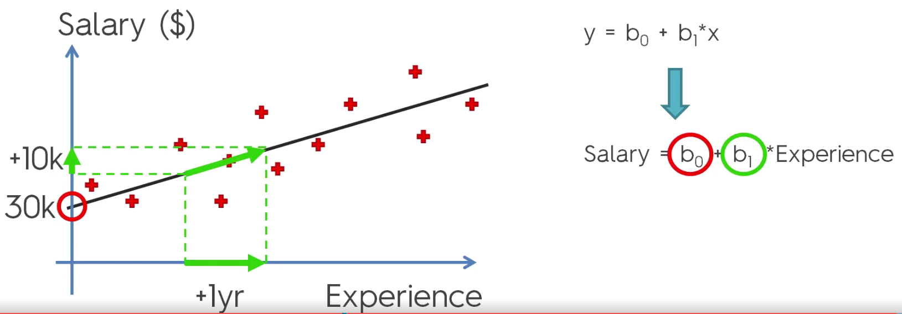
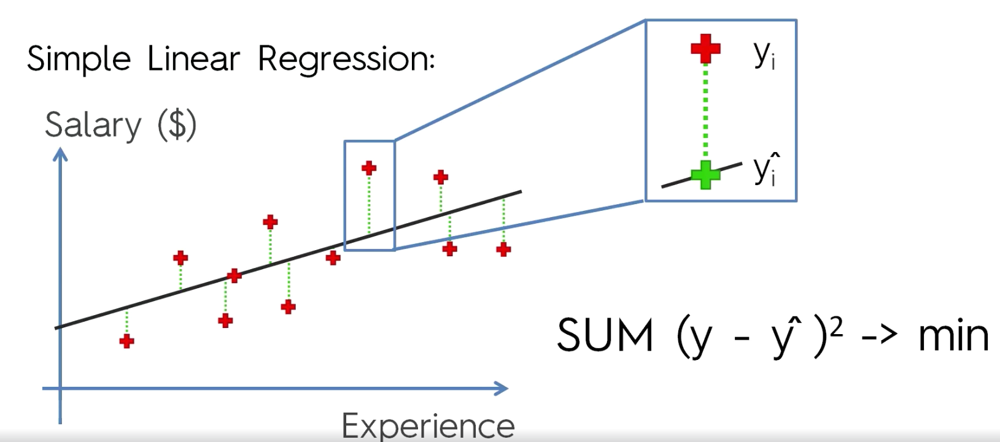
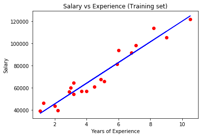
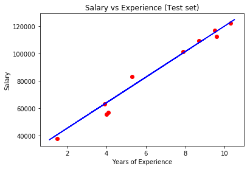

# Simple Linear Regression






Importing librairies and files


```python
import numpy as np
import matplotlib.pyplot as plt
import pandas as pd

dataset = pd.read_csv('Salary_Data.csv')
dataset
```


<div>
<style scoped>
    .dataframe tbody tr th:only-of-type {
        vertical-align: middle;
    }

    .dataframe tbody tr th {
        vertical-align: top;
    }

    .dataframe thead th {
        text-align: right;
    }
</style>
<table border="1" class="dataframe">
  <thead>
    <tr style="text-align: right;">
      <th></th>
      <th>YearsExperience</th>
      <th>Salary</th>
    </tr>
  </thead>
  <tbody>
    <tr>
      <th>0</th>
      <td>1.1</td>
      <td>39343.0</td>
    </tr>
    <tr>
      <th>1</th>
      <td>1.3</td>
      <td>46205.0</td>
    </tr>
    <tr>
      <th>2</th>
      <td>1.5</td>
      <td>37731.0</td>
    </tr>
    <tr>
      <th>3</th>
      <td>2.0</td>
      <td>43525.0</td>
    </tr>
    <tr>
      <th>4</th>
      <td>2.2</td>
      <td>39891.0</td>
    </tr>
    <tr>
      <th>5</th>
      <td>2.9</td>
      <td>56642.0</td>
    </tr>
    <tr>
      <th>6</th>
      <td>3.0</td>
      <td>60150.0</td>
    </tr>
    <tr>
      <th>7</th>
      <td>3.2</td>
      <td>54445.0</td>
    </tr>
    <tr>
      <th>8</th>
      <td>3.2</td>
      <td>64445.0</td>
    </tr>
    <tr>
      <th>9</th>
      <td>3.7</td>
      <td>57189.0</td>
    </tr>
    <tr>
      <th>10</th>
      <td>3.9</td>
      <td>63218.0</td>
    </tr>
    <tr>
      <th>11</th>
      <td>4.0</td>
      <td>55794.0</td>
    </tr>
    <tr>
      <th>12</th>
      <td>4.0</td>
      <td>56957.0</td>
    </tr>
    <tr>
      <th>13</th>
      <td>4.1</td>
      <td>57081.0</td>
    </tr>
    <tr>
      <th>14</th>
      <td>4.5</td>
      <td>61111.0</td>
    </tr>
    <tr>
      <th>15</th>
      <td>4.9</td>
      <td>67938.0</td>
    </tr>
    <tr>
      <th>16</th>
      <td>5.1</td>
      <td>66029.0</td>
    </tr>
    <tr>
      <th>17</th>
      <td>5.3</td>
      <td>83088.0</td>
    </tr>
    <tr>
      <th>18</th>
      <td>5.9</td>
      <td>81363.0</td>
    </tr>
    <tr>
      <th>19</th>
      <td>6.0</td>
      <td>93940.0</td>
    </tr>
    <tr>
      <th>20</th>
      <td>6.8</td>
      <td>91738.0</td>
    </tr>
    <tr>
      <th>21</th>
      <td>7.1</td>
      <td>98273.0</td>
    </tr>
    <tr>
      <th>22</th>
      <td>7.9</td>
      <td>101302.0</td>
    </tr>
    <tr>
      <th>23</th>
      <td>8.2</td>
      <td>113812.0</td>
    </tr>
    <tr>
      <th>24</th>
      <td>8.7</td>
      <td>109431.0</td>
    </tr>
    <tr>
      <th>25</th>
      <td>9.0</td>
      <td>105582.0</td>
    </tr>
    <tr>
      <th>26</th>
      <td>9.5</td>
      <td>116969.0</td>
    </tr>
    <tr>
      <th>27</th>
      <td>9.6</td>
      <td>112635.0</td>
    </tr>
    <tr>
      <th>28</th>
      <td>10.3</td>
      <td>122391.0</td>
    </tr>
    <tr>
      <th>29</th>
      <td>10.5</td>
      <td>121872.0</td>
    </tr>
  </tbody>
</table>
</div>


Choosing Independent ( __matrix of features X__ -> YearsExprerience ) & Depedent ( __vector Y__ -> Salary) variables


```python
X = dataset.iloc[:, :-1].values
Y = dataset.iloc[:, 1].values

X, Y
```


    (array([[  1.1],
            [  1.3],
            [  1.5],
            [  2. ],
            [  2.2],
            [  2.9],
            [  3. ],
            [  3.2],
            [  3.2],
            [  3.7],
            [  3.9],
            [  4. ],
            [  4. ],
            [  4.1],
            [  4.5],
            [  4.9],
            [  5.1],
            [  5.3],
            [  5.9],
            [  6. ],
            [  6.8],
            [  7.1],
            [  7.9],
            [  8.2],
            [  8.7],
            [  9. ],
            [  9.5],
            [  9.6],
            [ 10.3],
            [ 10.5]]),
     array([  39343.,   46205.,   37731.,   43525.,   39891.,   56642.,
              60150.,   54445.,   64445.,   57189.,   63218.,   55794.,
              56957.,   57081.,   61111.,   67938.,   66029.,   83088.,
              81363.,   93940.,   91738.,   98273.,  101302.,  113812.,
             109431.,  105582.,  116969.,  112635.,  122391.,  121872.]))


Splitting the dataset into the Training set and Test set

We have 30 observations so let's take 20 for the training set and 10 for the test set ( normally its more like 80/20)


```python
from sklearn.cross_validation import train_test_split
X_train, X_test, Y_train, Y_test = train_test_split(X, Y, test_size = 1/3, random_state = 0)
```

    c:\users\yanni iyeze\appdata\local\programs\python\python36-32\lib\site-packages\sklearn\cross_validation.py:41: DeprecationWarning: This module was deprecated in version 0.18 in favor of the model_selection module into which all the refactored classes and functions are moved. Also note that the interface of the new CV iterators are different from that of this module. This module will be removed in 0.20.
      "This module will be removed in 0.20.", DeprecationWarning)


We don't need to take care of Feature Scaling for the linear regression

Fitting Simple Linear Regression to the Training set using the LinearRegression class : http://scikit-learn.org/stable/modules/generated/sklearn.linear_model.LinearRegression.html


```python
from sklearn.linear_model import LinearRegression
regressor = LinearRegression()
regressor.fit(X_train, Y_train)
```


    LinearRegression(copy_X=True, fit_intercept=True, n_jobs=1, normalize=False)


Predicting the Test set results


```python
Y_pred = regressor.predict(X_test)
```


```python
# Visualising the Training set results
plt.scatter(X_train, Y_train, color = 'red')
plt.plot(X_train, regressor.predict(X_train), color = 'blue')
plt.title('Salary vs Experience (Training set)')
plt.xlabel('Years of Experience')
plt.ylabel('Salary')
plt.show()
```





```python
# Visualising the Test set results
plt.scatter(X_test, Y_test, color = 'red')
plt.plot(X_train, regressor.predict(X_train), color = 'blue')
plt.title('Salary vs Experience (Test set)')
plt.xlabel('Years of Experience')
plt.ylabel('Salary')
plt.show()
```



