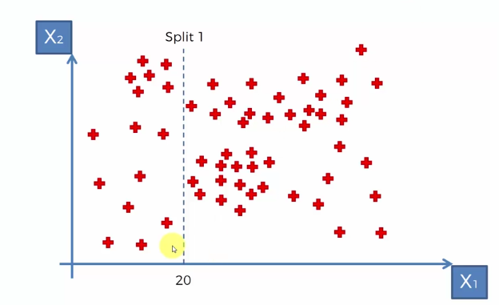

# Decision Tree Regression

CART : Classification and Regression Trees, there are two types of decision trees. In this section, we will be focused on the Regression trees.

They are a bit more complex than Classification trees.


If you see the scatter plot above a representation of our dataset .

We have 2 independent variables (features X1, X2) to prodict Y (depedent variable) which is in third dimension (projections of all the points).

When we run a regression decision tree the scatter will be split up into segments.


How and when the split are conducted ? This is determined by the algorithm and it involves looking at an information called ["entropy"](http://www.saedsayad.com/decision_tree.htm). It means that when I perform the split, is these splits increasing the amount of information that we have about our points. Is it actually adding some value to our way to group the points.

The algorithm knows when to stop; its when we can't add more information into the leaves/splits (ex: Stop when you have less than 5% of the total in one leaf)

Lets create our Decision tree :

The Split started at X1 < 20




Next happens Split 2 which start at point X2 < 170 .


Next Split 3 check if X2 < 200


And for same for Split 4 (x < 40)


How the information (X1 and X2) splitted into leaves will help us to predict Y ?

It's pretty straight forward, it will take the average of y  for each terminal leaves.


Now let's begin with our example and import our dataset


```python
import numpy as np
import matplotlib.pyplot as plt
import pandas as pd

dataset = pd.read_csv('Position_Salaries.csv')
print(dataset)

plt.scatter(dataset['Level'], dataset['Salary'])
plt.show()
```

                Position  Level   Salary
    0   Business Analyst      1    45000
    1  Junior Consultant      2    50000
    2  Senior Consultant      3    60000
    3            Manager      4    80000
    4    Country Manager      5   110000
    5     Region Manager      6   150000
    6            Partner      7   200000
    7     Senior Partner      8   300000
    8            C-level      9   500000
    9                CEO     10  1000000


    <matplotlib.figure.Figure at 0x3c8f7f0>


```python
X = dataset.iloc[:, 1:2].values
y = dataset.iloc[:, 2].values

X,y
```


    (array([[ 1],
            [ 2],
            [ 3],
            [ 4],
            [ 5],
            [ 6],
            [ 7],
            [ 8],
            [ 9],
            [10]], dtype=int64),
     array([  45000,   50000,   60000,   80000,  110000,  150000,  200000,
             300000,  500000, 1000000], dtype=int64))


```python
# Fitting Decision Tree Regression to the dataset
from sklearn.tree import DecisionTreeRegressor
regressor = DecisionTreeRegressor(random_state = 0)
regressor.fit(X, y)
```


    DecisionTreeRegressor(criterion='mse', max_depth=None, max_features=None,
               max_leaf_nodes=None, min_impurity_decrease=0.0,
               min_impurity_split=None, min_samples_leaf=1,
               min_samples_split=2, min_weight_fraction_leaf=0.0,
               presort=False, random_state=0, splitter='best')


```python
# Predicting a new result
y_pred = regressor.predict(6.5)

y_pred[0]
```


    150000.0


```python
# Visualising the Regression results
plt.scatter(X, y, color = 'red')
plt.scatter(6.5, y_pred, color = 'green')
plt.plot(X, regressor.predict(X), color = 'blue')
plt.title('Truth or Bluff (Decision Tree Regression)')
plt.xlabel('Position level')
plt.ylabel('Salary')
plt.show()
```


Now we have a non linear and non continous model that's why the viz above is not correct.

The decision tree model is not continuous, so we need to visualize the regression model with a better resolution


```python
# Visualising the Decision Tree Regression results (higher resolution)
X_grid = np.arange(min(X), max(X), 0.01)
X_grid = X_grid.reshape((len(X_grid), 1))
plt.scatter(X, y, color = 'red')
plt.scatter(6.5, y_pred, color = 'green')
plt.plot(X_grid, regressor.predict(X_grid), color = 'blue')
plt.title('Truth or Bluff (Decision Tree Regression)')
plt.xlabel('Position level')
plt.ylabel('Salary')
plt.show()
```


