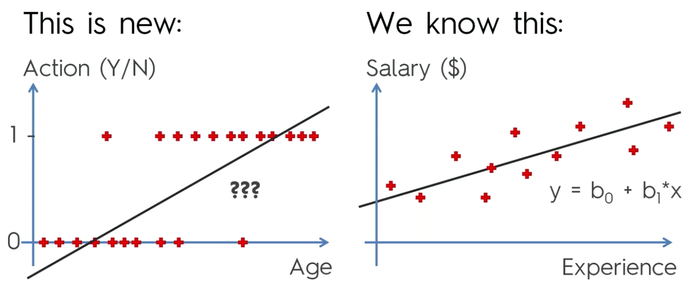
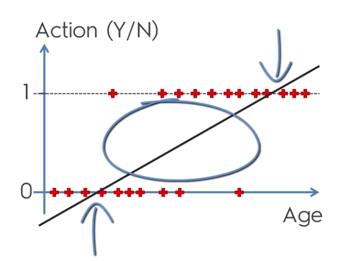
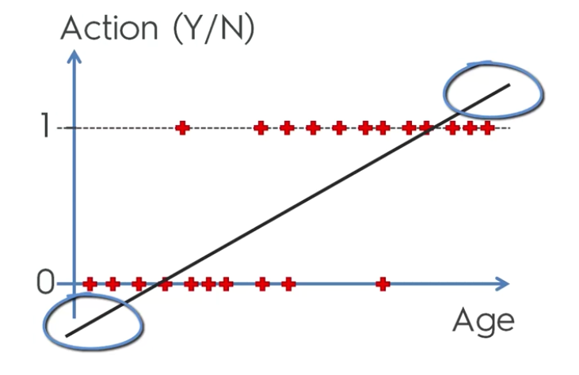
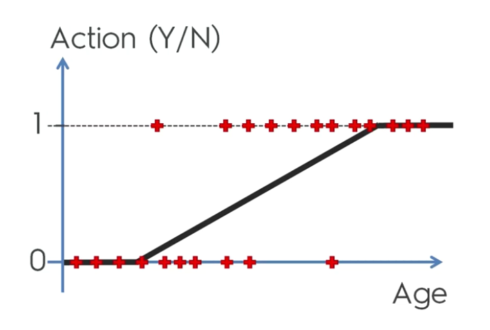
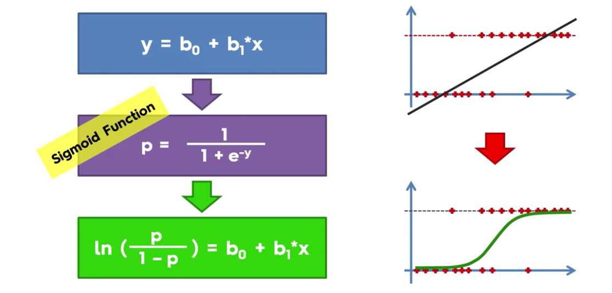
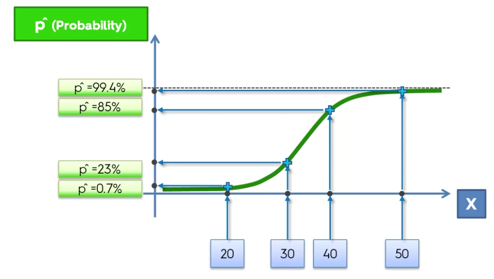
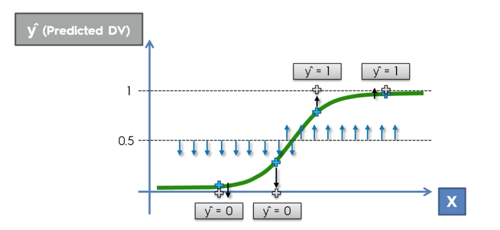

# Logistic Regression

Let's imagine we want to predict for a person with a certain age if he is going to do an action or not.

If we are using the same Linear regression models to predict used previously it would be difficult to find the model which will fit all the observations.



Instead of predicting exactly what's going to happen (Yes or No), we can try to predict the probability/likelyhood of the person to do this actions.

But the linear regression line can make sense because it could fit probabilities between 0 and 1 for unknown observations which is the part in the middle of our scatter plot.



But the parts that doesn't make sense are in the top and in the bottom of the regression line which contains values lower than 0 and greater than 1.



What we can do to fit our observations is to draw this linear regression line and replace by horizontal lines at the top and the bottom.



If we use Sigmoid function to replace y and change our linear regression equation, we will get the equation of the Logistic regression.



The line of the logistic regression is using the formula to fit the dataset. We are doing the same thing we done with Linear Regression.

We can use Logistic regression to predict a probability (p_hat) which is better to have a 0 or 1.

How are we going to use this Logistic regression line ?

by projecting X values on the line you will get the given probability.



So we are going to get a prediction value for y.

To get the predicted y value , the approach is very arbitrary; you have to select a reference line (ex : y^ = 0,5) and anything below this line will be projected into the 0 line.
Anything above the reference line wil be projected on the upper value.

_Ex : if your probability to do this action is less than 50% , you wan't do it_



Now let's illustrate that with an example and import te dataset which contain a list of people and their informations and we want to know if they are going to by an SUV (Purchased column) by using the age and estimated salary;


```python
import numpy as np
import matplotlib.pyplot as plt
import pandas as pd

dataset = pd.read_csv('Social_Network_Ads.csv')
dataset.head(10)
```


<div>
<style scoped>
    .dataframe tbody tr th:only-of-type {
        vertical-align: middle;
    }

    .dataframe tbody tr th {
        vertical-align: top;
    }

    .dataframe thead th {
        text-align: right;
    }
</style>
<table border="1" class="dataframe">
  <thead>
    <tr style="text-align: right;">
      <th></th>
      <th>User ID</th>
      <th>Gender</th>
      <th>Age</th>
      <th>EstimatedSalary</th>
      <th>Purchased</th>
    </tr>
  </thead>
  <tbody>
    <tr>
      <th>0</th>
      <td>15624510</td>
      <td>Male</td>
      <td>19</td>
      <td>19000</td>
      <td>0</td>
    </tr>
    <tr>
      <th>1</th>
      <td>15810944</td>
      <td>Male</td>
      <td>35</td>
      <td>20000</td>
      <td>0</td>
    </tr>
    <tr>
      <th>2</th>
      <td>15668575</td>
      <td>Female</td>
      <td>26</td>
      <td>43000</td>
      <td>0</td>
    </tr>
    <tr>
      <th>3</th>
      <td>15603246</td>
      <td>Female</td>
      <td>27</td>
      <td>57000</td>
      <td>0</td>
    </tr>
    <tr>
      <th>4</th>
      <td>15804002</td>
      <td>Male</td>
      <td>19</td>
      <td>76000</td>
      <td>0</td>
    </tr>
    <tr>
      <th>5</th>
      <td>15728773</td>
      <td>Male</td>
      <td>27</td>
      <td>58000</td>
      <td>0</td>
    </tr>
    <tr>
      <th>6</th>
      <td>15598044</td>
      <td>Female</td>
      <td>27</td>
      <td>84000</td>
      <td>0</td>
    </tr>
    <tr>
      <th>7</th>
      <td>15694829</td>
      <td>Female</td>
      <td>32</td>
      <td>150000</td>
      <td>1</td>
    </tr>
    <tr>
      <th>8</th>
      <td>15600575</td>
      <td>Male</td>
      <td>25</td>
      <td>33000</td>
      <td>0</td>
    </tr>
    <tr>
      <th>9</th>
      <td>15727311</td>
      <td>Female</td>
      <td>35</td>
      <td>65000</td>
      <td>0</td>
    </tr>
  </tbody>
</table>
</div>


We are going to take the column Age and Salary for build our independent variable matrix and the Purchased column for our dependent variable vector Y


```python
X = dataset.iloc[:, [2, 3]].values
y = dataset.iloc[:, 4].values

X[:5,:], y[:5]
```


    (array([[   19, 19000],
            [   35, 20000],
            [   26, 43000],
            [   27, 57000],
            [   19, 76000]], dtype=int64), array([0, 0, 0, 0, 0], dtype=int64))


We can now split our dataset into Test and Train sets

We have 400 observations so we will put 25% of the dataset to the test set.


```python
# Splitting the dataset into the Training set and Test set
from sklearn.cross_validation import train_test_split
X_train, X_test, y_train, y_test = train_test_split(X, y, test_size = 0.25, random_state = 0)
```

    c:\users\yanni iyeze\appdata\local\programs\python\python36-32\lib\site-packages\sklearn\cross_validation.py:41: DeprecationWarning: This module was deprecated in version 0.18 in favor of the model_selection module into which all the refactored classes and functions are moved. Also note that the interface of the new CV iterators are different from that of this module. This module will be removed in 0.20.
      "This module will be removed in 0.20.", DeprecationWarning)


We need to apply feature scaling on X to have an accurate predictions.
We juste use transform for X_test because we already fit sc wih X_train


```python
# Feature Scaling
from sklearn.preprocessing import StandardScaler
sc = StandardScaler()
X_train = sc.fit_transform(X_train)
X_test = sc.transform(X_test)
```

    c:\users\yanni iyeze\appdata\local\programs\python\python36-32\lib\site-packages\sklearn\utils\validation.py:475: DataConversionWarning: Data with input dtype int64 was converted to float64 by StandardScaler.
      warnings.warn(msg, DataConversionWarning)


```python
# Fitting Logistic Regression to the Training set
from sklearn.linear_model import LogisticRegression
classifier = LogisticRegression(random_state = 0)
classifier.fit(X_train, y_train)
```


    LogisticRegression(C=1.0, class_weight=None, dual=False, fit_intercept=True,
              intercept_scaling=1, max_iter=100, multi_class='ovr', n_jobs=1,
              penalty='l2', random_state=0, solver='liblinear', tol=0.0001,
              verbose=0, warm_start=False)


```python
# Predicting the Test set results - Vector of prediction
y_pred = classifier.predict(X_test)

y_pred
```


    array([0, 0, 0, 0, 0, 0, 0, 1, 0, 1, 0, 0, 0, 0, 0, 0, 0, 0, 1, 0, 0, 1, 0,
           1, 0, 1, 0, 0, 0, 0, 0, 0, 1, 0, 0, 0, 0, 0, 0, 1, 0, 0, 0, 0, 1, 0,
           0, 1, 0, 1, 1, 0, 0, 0, 1, 0, 0, 0, 0, 0, 0, 1, 0, 0, 0, 1, 0, 0, 0,
           0, 1, 0, 0, 0, 0, 0, 1, 0, 1, 1, 1, 1, 0, 0, 1, 1, 0, 1, 0, 0, 0, 1,
           0, 0, 0, 0, 0, 0, 1, 1], dtype=int64)


The confusion matrix is used to evaluate our classifier model


```python
# Making the Confusion Matrix (confusion_matrix(real value - test, vector of prediction))
from sklearn.metrics import confusion_matrix
cm = confusion_matrix(y_test, y_pred)

cm
```


    array([[65,  3],
           [ 8, 24]], dtype=int64)


65 and 24 are the correct predictions and 3 and 8 are the wrong ones

Let's visualising the Training and Test results


```python
# Visualising the Training set results
from matplotlib.colors import ListedColormap
X_set, y_set = X_train, y_train
X1, X2 = np.meshgrid(np.arange(start = X_set[:, 0].min() - 1, stop = X_set[:, 0].max() + 1, step = 0.01),
                     np.arange(start = X_set[:, 1].min() - 1, stop = X_set[:, 1].max() + 1, step = 0.01))
plt.contourf(X1, X2, classifier.predict(np.array([X1.ravel(), X2.ravel()]).T).reshape(X1.shape),
             alpha = 0.75, cmap = ListedColormap(('red', 'green')))
plt.xlim(X1.min(), X1.max())
plt.ylim(X2.min(), X2.max())
for i, j in enumerate(np.unique(y_set)):
    plt.scatter(X_set[y_set == j, 0], X_set[y_set == j, 1],
                c = ListedColormap(('red', 'green'))(i), label = j)
plt.title('Logistic Regression (Training set)')
plt.xlabel('Age')
plt.ylabel('Estimated Salary')
plt.legend()
plt.show()
```


All the points you are seeing on this viz is the observations of the training set (all the users of the social networks). Each of user is caracterised by is Age and Estimated salary.

The red point are the users who didn't buy a SUV and the green are users who bought one.

We can say that Most of the young user with a low estimated salary didn't buy an SUV. Most of the older users with a bigger estimated salary bought an SUV.

The goal of the classifier is to classify the right users into the right category which are called __prediction region__. __The points are the truth and the regions are the prediction__.

So a company for a campain will target users in the green region because they might buy an SUV.

The regions are seperated by a straight line called the __prediction boundary__. This is straight because our Logistic regression classifier is a __linear classifier__.

Our classifier has almost a good job. We got some "mispredictions" because of the linear classifier and the non linear distribution of the users. To work properly our classifier need to make a kind of a __curve__ to catch the right users in the right region.

But we have just see the results of our classifier on the training set. Let's see if it is still working with new observations using the test set.


```python
# Visualising the Test set results
from matplotlib.colors import ListedColormap
X_set, y_set = X_test, y_test
X1, X2 = np.meshgrid(np.arange(start = X_set[:, 0].min() - 1, stop = X_set[:, 0].max() + 1, step = 0.01),
                     np.arange(start = X_set[:, 1].min() - 1, stop = X_set[:, 1].max() + 1, step = 0.01))
plt.contourf(X1, X2, classifier.predict(np.array([X1.ravel(), X2.ravel()]).T).reshape(X1.shape),
             alpha = 0.75, cmap = ListedColormap(('red', 'green')))
plt.xlim(X1.min(), X1.max())
plt.ylim(X2.min(), X2.max())
for i, j in enumerate(np.unique(y_set)):
    plt.scatter(X_set[y_set == j, 0], X_set[y_set == j, 1],
                c = ListedColormap(('red', 'green'))(i), label = j)
plt.title('Logistic Regression (Test set)')
plt.xlabel('Age')
plt.ylabel('Estimated Salary')
plt.legend()
plt.show()
```


The classifier seems to also work with the test set !!

### But How to make this viz ?

We took all the pixels (0.01) of the frame and we apply the classier on it to predict if it value is one or 0 then put the color.

First importing the library

`from matplotlib.colors import ListedColormap`

Then create local variables to replace X and y

`X_set, y_set = X_test, y_test`

Preparing the grid of pixel points :
- we take the minimum of the age values and -1 to don't have the points close to the axis
- we take the maximum of the age values and +1 to don't have the points close to the axis
- We are repeating the same steps above for the salary
- define the step for the resolution

`X1, X2 = np.meshgrid(np.arange(start = X_set[:, 0].min() - 1, stop = X_set[:, 0].max() + 1, step = 0.01),
 np.arange(start = X_set[:, 1].min() - 1, stop = X_set[:, 1].max() + 1, step = 0.01))
`

Then we will apply the classifier on all the pixel points and add a contour for the prediction region.

`
plt.contourf(X1, X2, classifier.predict(np.array([X1.ravel(), X2.ravel()]).T).reshape(X1.shape),
alpha = 0.75, cmap = ListedColormap(('red', 'green')))
`
and plot our observations.

`
plt.xlim(X1.min(), X1.max())
plt.ylim(X2.min(), X2.max())
for i, j in enumerate(np.unique(y_set)):
plt.scatter(X_set[y_set == j, 0], X_set[y_set == j, 1],
c = ListedColormap(('red', 'green'))(i), label = j)
`
