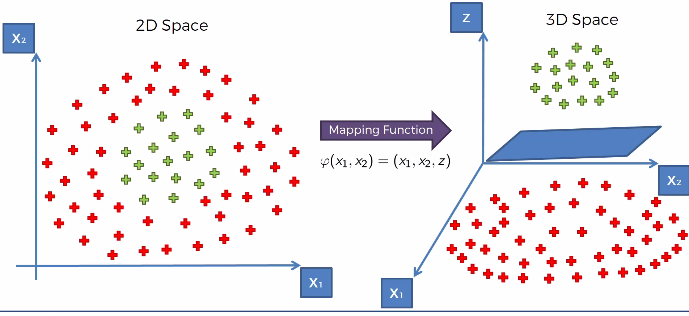

# Kernel SVM

Using the SVM algorithm, whats happen when we can't find a boundary (line) ?


This happen because in this case the data is __not lineary separable__.


## Mapping to a higher-dimensional space

With 1 dimension the boundary(separator) would be point.


Even in this exemple, we can't separate the points.

With 2 dimension is a line and 3 an hyperplane etc ...

For this example start to apply a mapping function in order to separate lineary our data points.


If we take our first example, we could find a mapping function which will make transform our data points from the 2D Space to 3D Space in order to get a separable dataset (the seprator would be an hyperplane).



The support vector machine algorithm has helped us build this hyperplane and then we project back to the 2D space and we got a circle as a non linear separator


But mapping to a higher dimensional space can be __highly compute-intensive__.

## The Kernel Trick

The Gaussian RBF Kernel


This function it's a function applied to two vectors. x is a sort of point in our dataset and l stands for Landmark.

Let's visualize this function for a specific sigma and landmark.


The landmark is the projection of the point in the middle.


If we simulate x in the function to get a big or small distance from the landmark, we will see that greater is the distance smaller is the distance (close to 0). Lower is the distance, greater is the result (close to 1)


We are going to use this Kernel function to separate our dataset to build that decision.

If we try to reproduce this function in a 2d space, we first trying to put the landmark (we are not going to detail how to place the landmark, some methodologies/algorithms can be used) somewhere between the dataset points.


The circle around this kernel function is actually projected into our visualisation.


This circle allow us to take all points that are inside and assign them a value above 0 and everything outside will get a value of 0.

The sigma will define the circumference of the circle, if we increase the sigma the circumference will also increase and take more points.


Using this Kernel function, we are not mapping our dataset to a higher dimension space but our computations are done in a lower dimension space.

That's can help you to solve much complex problem by combining kernel functions.


## Type of Kernel Functions


Now let's start a practical example an import our dataset and the preprocessing step.


```python
# Importing the libraries
import numpy as np
import matplotlib.pyplot as plt
import pandas as pd

# Importing the dataset
dataset = pd.read_csv('Social_Network_Ads.csv')
X = dataset.iloc[:, [2, 3]].values
y = dataset.iloc[:, 4].values

# Splitting the dataset into the Training set and Test set
from sklearn.model_selection import train_test_split
X_train, X_test, y_train, y_test = train_test_split(X, y, test_size = 0.25, random_state = 0)

# Feature Scaling
from sklearn.preprocessing import StandardScaler
sc = StandardScaler()
X_train = sc.fit_transform(X_train)
X_test = sc.transform(X_test)
```

    /usr/local/lib/python3.7/site-packages/sklearn/utils/validation.py:590: DataConversionWarning: Data with input dtype int64 was converted to float64 by StandardScaler.
      warnings.warn(msg, DataConversionWarning)
    /usr/local/lib/python3.7/site-packages/sklearn/utils/validation.py:590: DataConversionWarning: Data with input dtype int64 was converted to float64 by StandardScaler.
      warnings.warn(msg, DataConversionWarning)
    /usr/local/lib/python3.7/site-packages/sklearn/utils/validation.py:590: DataConversionWarning: Data with input dtype int64 was converted to float64 by StandardScaler.
      warnings.warn(msg, DataConversionWarning)


```python
# Fitting Kernel SVM to the Training set
from sklearn.svm import SVC
classifier = SVC(kernel = 'rbf', random_state = 0)
classifier.fit(X_train, y_train)

# Predicting the Test set results
y_pred = classifier.predict(X_test)

# Comparing Predictions with Test set
results = pd.DataFrame({'y_test': y_test, 'y_pred': y_pred})
l = []
for index, row in results.iterrows():
    if row['y_test'] == row['y_pred']:
        result = 'Yes'
    else:
        result = 'No'
    l.append(result)
results['is ok ?'] = l

print(results)
```

        y_test  y_pred is ok ?
    0        0       0     Yes
    1        0       0     Yes
    2        0       0     Yes
    3        0       0     Yes
    4        0       0     Yes
    5        0       0     Yes
    6        0       0     Yes
    7        1       1     Yes
    8        0       0     Yes
    9        0       1      No
    10       0       0     Yes
    11       0       0     Yes
    12       0       0     Yes
    13       0       0     Yes
    14       0       0     Yes
    15       0       1      No
    16       0       0     Yes
    17       0       0     Yes
    18       1       1     Yes
    19       0       0     Yes
    20       0       0     Yes
    21       1       1     Yes
    22       0       0     Yes
    23       1       1     Yes
    24       0       0     Yes
    25       1       1     Yes
    26       0       0     Yes
    27       0       0     Yes
    28       0       0     Yes
    29       0       0     Yes
    ..     ...     ...     ...
    70       1       1     Yes
    71       0       0     Yes
    72       0       0     Yes
    73       1       1     Yes
    74       0       0     Yes
    75       0       0     Yes
    76       0       0     Yes
    77       0       0     Yes
    78       1       1     Yes
    79       1       1     Yes
    80       1       1     Yes
    81       0       1      No
    82       0       0     Yes
    83       0       0     Yes
    84       1       1     Yes
    85       1       0      No
    86       0       0     Yes
    87       1       1     Yes
    88       1       1     Yes
    89       0       0     Yes
    90       0       0     Yes
    91       1       1     Yes
    92       0       0     Yes
    93       0       0     Yes
    94       0       0     Yes
    95       1       0      No
    96       0       0     Yes
    97       1       1     Yes
    98       1       1     Yes
    99       1       1     Yes
    
    [100 rows x 3 columns]


```python
# Making the Confusion Matrix
from sklearn.metrics import confusion_matrix
cm = confusion_matrix(y_test, y_pred)

cm
```


    array([[64,  4],
           [ 3, 29]])


```python
# Visualising the Training set results
from matplotlib.colors import ListedColormap
X_set, y_set = X_train, y_train
X1, X2 = np.meshgrid(np.arange(start = X_set[:, 0].min() - 1, stop = X_set[:, 0].max() + 1, step = 0.01),
                     np.arange(start = X_set[:, 1].min() - 1, stop = X_set[:, 1].max() + 1, step = 0.01))
plt.contourf(X1, X2, classifier.predict(np.array([X1.ravel(), X2.ravel()]).T).reshape(X1.shape),
             alpha = 0.75, cmap = ListedColormap(('red', 'green')))
plt.xlim(X1.min(), X1.max())
plt.ylim(X2.min(), X2.max())
for i, j in enumerate(np.unique(y_set)):
    plt.scatter(X_set[y_set == j, 0], X_set[y_set == j, 1],
                c = ListedColormap(('red', 'green'))(i), label = j)
plt.title('Kernel SVM (Training set)')
plt.xlabel('Age')
plt.ylabel('Estimated Salary')
plt.legend()
plt.show()
```

    'c' argument looks like a single numeric RGB or RGBA sequence, which should be avoided as value-mapping will have precedence in case its length matches with 'x' & 'y'.  Please use a 2-D array with a single row if you really want to specify the same RGB or RGBA value for all points.
    'c' argument looks like a single numeric RGB or RGBA sequence, which should be avoided as value-mapping will have precedence in case its length matches with 'x' & 'y'.  Please use a 2-D array with a single row if you really want to specify the same RGB or RGBA value for all points.


```python
# Visualising the Test set results
from matplotlib.colors import ListedColormap
X_set, y_set = X_test, y_test
X1, X2 = np.meshgrid(np.arange(start = X_set[:, 0].min() - 1, stop = X_set[:, 0].max() + 1, step = 0.01),
                     np.arange(start = X_set[:, 1].min() - 1, stop = X_set[:, 1].max() + 1, step = 0.01))
plt.contourf(X1, X2, classifier.predict(np.array([X1.ravel(), X2.ravel()]).T).reshape(X1.shape),
             alpha = 0.75, cmap = ListedColormap(('red', 'green')))
plt.xlim(X1.min(), X1.max())
plt.ylim(X2.min(), X2.max())
for i, j in enumerate(np.unique(y_set)):
    plt.scatter(X_set[y_set == j, 0], X_set[y_set == j, 1],
                c = ListedColormap(('red', 'green'))(i), label = j)
plt.title('Kernel SVM (Test set)')
plt.xlabel('Age')
plt.ylabel('Estimated Salary')
plt.legend()
plt.show()
```

    'c' argument looks like a single numeric RGB or RGBA sequence, which should be avoided as value-mapping will have precedence in case its length matches with 'x' & 'y'.  Please use a 2-D array with a single row if you really want to specify the same RGB or RGBA value for all points.
    'c' argument looks like a single numeric RGB or RGBA sequence, which should be avoided as value-mapping will have precedence in case its length matches with 'x' & 'y'.  Please use a 2-D array with a single row if you really want to specify the same RGB or RGBA value for all points.


```python

```
