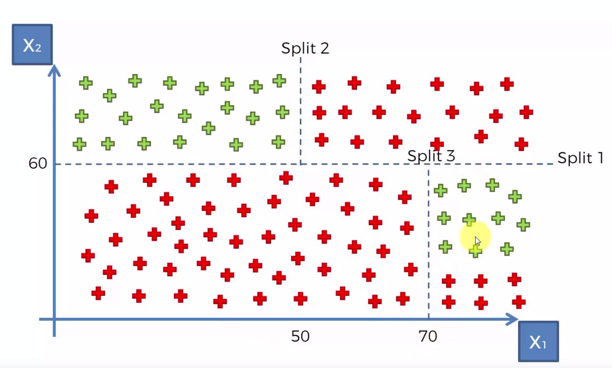

# Decision Tree Classification

Following the CART meaning (regression and classification decision trees), decision trees classification will work the same way as regression by splitting the dataset in order to get our final splits (terminal leaves) for points.


Let's build our decision tree.

Split1 : is X2 > 60 ?


Split 2: X2 > 60 & X1 < 50 ?


This split can already tell us if somethig is green or red.

Split 3 : X2 < 60 & X1 > 70 ?




Split 4: X2 < 60 & X1 < 70 & X2 < 20


Now with our terminal leaves we can classify correctly our red and green datapoints.

Decision trees it's an old method which is replaced by some other methods (Random Forest, Gradient Boosting) using kind of the same principle.

Now let's start our quick example.


```python
# Importing the libraries
import numpy as np
import matplotlib.pyplot as plt
import pandas as pd

# Importing the dataset
dataset = pd.read_csv('Social_Network_Ads.csv')
X = dataset.iloc[:, [2, 3]].values
y = dataset.iloc[:, 4].values

dataset.head(5)
```


<div>
<style scoped>
    .dataframe tbody tr th:only-of-type {
        vertical-align: middle;
    }

    .dataframe tbody tr th {
        vertical-align: top;
    }

    .dataframe thead th {
        text-align: right;
    }
</style>
<table border="1" class="dataframe">
  <thead>
    <tr style="text-align: right;">
      <th></th>
      <th>User ID</th>
      <th>Gender</th>
      <th>Age</th>
      <th>EstimatedSalary</th>
      <th>Purchased</th>
    </tr>
  </thead>
  <tbody>
    <tr>
      <th>0</th>
      <td>15624510</td>
      <td>Male</td>
      <td>19</td>
      <td>19000</td>
      <td>0</td>
    </tr>
    <tr>
      <th>1</th>
      <td>15810944</td>
      <td>Male</td>
      <td>35</td>
      <td>20000</td>
      <td>0</td>
    </tr>
    <tr>
      <th>2</th>
      <td>15668575</td>
      <td>Female</td>
      <td>26</td>
      <td>43000</td>
      <td>0</td>
    </tr>
    <tr>
      <th>3</th>
      <td>15603246</td>
      <td>Female</td>
      <td>27</td>
      <td>57000</td>
      <td>0</td>
    </tr>
    <tr>
      <th>4</th>
      <td>15804002</td>
      <td>Male</td>
      <td>19</td>
      <td>76000</td>
      <td>0</td>
    </tr>
  </tbody>
</table>
</div>


```python
# Splitting the dataset into the Training set and Test set
from sklearn.model_selection import train_test_split
X_train, X_test, y_train, y_test = train_test_split(X, y, test_size = 0.25, random_state = 0)

# Feature Scaling
from sklearn.preprocessing import StandardScaler
sc = StandardScaler()
X_train = sc.fit_transform(X_train)
X_test = sc.transform(X_test)
```

    /usr/local/lib/python3.7/site-packages/sklearn/utils/validation.py:590: DataConversionWarning: Data with input dtype int64 was converted to float64 by StandardScaler.
      warnings.warn(msg, DataConversionWarning)
    /usr/local/lib/python3.7/site-packages/sklearn/utils/validation.py:590: DataConversionWarning: Data with input dtype int64 was converted to float64 by StandardScaler.
      warnings.warn(msg, DataConversionWarning)
    /usr/local/lib/python3.7/site-packages/sklearn/utils/validation.py:590: DataConversionWarning: Data with input dtype int64 was converted to float64 by StandardScaler.
      warnings.warn(msg, DataConversionWarning)


```python
# Fitting classifier to the Training set 
from sklearn.tree import DecisionTreeClassifier
classifier = DecisionTreeClassifier(criterion = 'entropy', random_state = 0)
classifier.fit(X_train, y_train)

# Predicting the Test set results
y_pred = classifier.predict(X_test)

# Comparing Predictions with Test set
results = pd.DataFrame({'y_test': y_test, 'y_pred': y_pred})
l = []
for index, row in results.iterrows():
    if row['y_test'] == row['y_pred']:
        result = 'Yes'
    else:
        result = 'No'
    l.append(result)
results['is ok ?'] = l

print(results)
```

        y_test  y_pred is ok ?
    0        0       0     Yes
    1        0       0     Yes
    2        0       0     Yes
    3        0       0     Yes
    4        0       0     Yes
    5        0       0     Yes
    6        0       0     Yes
    7        1       1     Yes
    8        0       0     Yes
    9        0       0     Yes
    10       0       0     Yes
    11       0       0     Yes
    12       0       0     Yes
    13       0       1      No
    14       0       0     Yes
    15       0       1      No
    16       0       1      No
    17       0       0     Yes
    18       1       1     Yes
    19       0       0     Yes
    20       0       0     Yes
    21       1       1     Yes
    22       0       0     Yes
    23       1       1     Yes
    24       0       0     Yes
    25       1       0      No
    26       0       0     Yes
    27       0       0     Yes
    28       0       0     Yes
    29       0       0     Yes
    ..     ...     ...     ...
    70       1       1     Yes
    71       0       0     Yes
    72       0       0     Yes
    73       1       1     Yes
    74       0       0     Yes
    75       0       0     Yes
    76       0       0     Yes
    77       0       0     Yes
    78       1       1     Yes
    79       1       1     Yes
    80       1       1     Yes
    81       0       1      No
    82       0       0     Yes
    83       0       0     Yes
    84       1       1     Yes
    85       1       0      No
    86       0       0     Yes
    87       1       1     Yes
    88       1       1     Yes
    89       0       0     Yes
    90       0       0     Yes
    91       1       1     Yes
    92       0       0     Yes
    93       0       0     Yes
    94       0       0     Yes
    95       1       1     Yes
    96       0       0     Yes
    97       1       1     Yes
    98       1       1     Yes
    99       1       1     Yes
    
    [100 rows x 3 columns]


```python
# Making the Confusion Matrix
from sklearn.metrics import confusion_matrix
cm = confusion_matrix(y_test, y_pred)
cm
```


    array([[62,  6],
           [ 3, 29]])


```python
# Visualising the Training set results
from matplotlib.colors import ListedColormap
X_set, y_set = X_train, y_train
X1, X2 = np.meshgrid(np.arange(start = X_set[:, 0].min() - 1, stop = X_set[:, 0].max() + 1, step = 0.01),
                     np.arange(start = X_set[:, 1].min() - 1, stop = X_set[:, 1].max() + 1, step = 0.01))
plt.contourf(X1, X2, classifier.predict(np.array([X1.ravel(), X2.ravel()]).T).reshape(X1.shape),
             alpha = 0.75, cmap = ListedColormap(('red', 'green')))
plt.xlim(X1.min(), X1.max())
plt.ylim(X2.min(), X2.max())
for i, j in enumerate(np.unique(y_set)):
    plt.scatter(X_set[y_set == j, 0], X_set[y_set == j, 1],
                c = ListedColormap(('red', 'green'))(i), label = j)
plt.title('Classifier (Training set)')
plt.xlabel('Age')
plt.ylabel('Estimated Salary')
plt.legend()
plt.show()
```

    'c' argument looks like a single numeric RGB or RGBA sequence, which should be avoided as value-mapping will have precedence in case its length matches with 'x' & 'y'.  Please use a 2-D array with a single row if you really want to specify the same RGB or RGBA value for all points.
    'c' argument looks like a single numeric RGB or RGBA sequence, which should be avoided as value-mapping will have precedence in case its length matches with 'x' & 'y'.  Please use a 2-D array with a single row if you really want to specify the same RGB or RGBA value for all points.


```python
# Visualising the Test set results
from matplotlib.colors import ListedColormap
X_set, y_set = X_test, y_test
X1, X2 = np.meshgrid(np.arange(start = X_set[:, 0].min() - 1, stop = X_set[:, 0].max() + 1, step = 0.01),
                     np.arange(start = X_set[:, 1].min() - 1, stop = X_set[:, 1].max() + 1, step = 0.01))
plt.contourf(X1, X2, classifier.predict(np.array([X1.ravel(), X2.ravel()]).T).reshape(X1.shape),
             alpha = 0.75, cmap = ListedColormap(('red', 'green')))
plt.xlim(X1.min(), X1.max())
plt.ylim(X2.min(), X2.max())
for i, j in enumerate(np.unique(y_set)):
    plt.scatter(X_set[y_set == j, 0], X_set[y_set == j, 1],
                c = ListedColormap(('red', 'green'))(i), label = j)
plt.title('Classifier (Test set)')
plt.xlabel('Age')
plt.ylabel('Estimated Salary')
plt.legend()
plt.show()
```

    'c' argument looks like a single numeric RGB or RGBA sequence, which should be avoided as value-mapping will have precedence in case its length matches with 'x' & 'y'.  Please use a 2-D array with a single row if you really want to specify the same RGB or RGBA value for all points.
    'c' argument looks like a single numeric RGB or RGBA sequence, which should be avoided as value-mapping will have precedence in case its length matches with 'x' & 'y'.  Please use a 2-D array with a single row if you really want to specify the same RGB or RGBA value for all points.


```python

```
