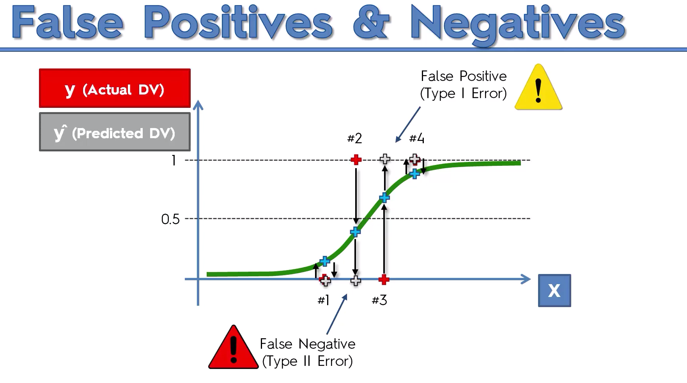

# Evaluating Classification Models Performance

## False Positives & False Negatives 

Using logistic regression you can get wrong predicted value which can be positives and negatives (worst)



## Confusion Matrix

You can use positives and negatives in a confusion matrix erros to calculate your __accuracy and error rate__


## Accuracy paradox

Let's take another confusion matrix as an example.


Let's say we predict that's the event is never going to happen, so we will get a new confusion matrix.


We can se that the accuracy rate is increasing and that strange. 
That's why you don't have to evaluate you model only with this accuracy rate but wth the __cumulative accuracy profile__.

## CAP(Cumulative Accuracy Profile) Curve


To analyse these curves and evaluate your model you have to calculate a ratio between aeras.


If this ratio is closer to 1 better is your model.

But we can just looking at different points instead of aeras.


## FAQ

### 1. What are the pros and cons of each model ?


### 2. How do I know which model to choose for my problem ?

Same as for regression models, you first need to figure out whether your problem is linear or non linear. You will learn how to do that in Part 10 - Model Selection. Then:

If your problem is linear, you should go for Logistic Regression or SVM.

If your problem is non linear, you should go for K-NN, Naive Bayes, Decision Tree or Random Forest.

Then which one should you choose in each case ? You will learn that in Part 10 - Model Selection with k-Fold Cross Validation.

Then from a business point of view, you would rather use:

- Logistic Regression or Naive Bayes when you want to rank your predictions by their probability. For example if you want to rank your customers from the highest probability that they buy a certain product, to the lowest probability. Eventually that allows you to target your marketing campaigns. And of course for this type of business problem, you should use Logistic Regression if your problem is linear, and Naive Bayes if your problem is non linear.

- SVM when you want to predict to which segment your customers belong to. Segments can be any kind of segments, for example some market segments you identified earlier with clustering.

- Decision Tree when you want to have clear interpretation of your model results,

- Random Forest when you are just looking for high performance with less need for interpretation. 

### 3. How can I improve each of these models ?

Same answer as in Part 2: 

In Part 10 - Model Selection, you will find the second section dedicated to Parameter Tuning, that will allow you to improve the performance of your models, by tuning them. You probably already noticed that each model is composed of two types of parameters:

    the parameters that are learnt, for example the coefficients in Linear Regression,
    the hyperparameters.

The hyperparameters are the parameters that are not learnt and that are fixed values inside the model equations. For example, the regularization parameter lambda or the penalty parameter C are hyperparameters. So far we used the default value of these hyperparameters, and we haven't searched for their optimal value so that your model reaches even higher performance. Finding their optimal value is exactly what Parameter Tuning is about. So for those of you already interested in improving your model performance and doing some parameter tuning, feel free to jump directly to Part 10 - Model Selection.


```python

```
