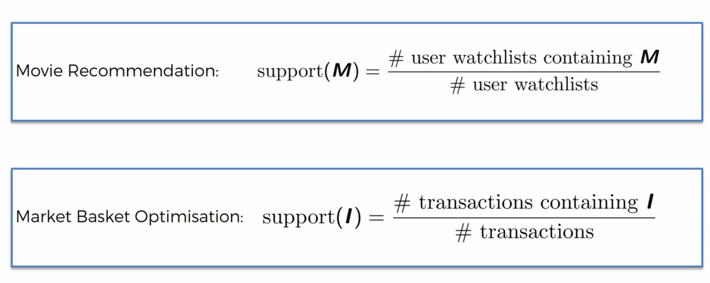
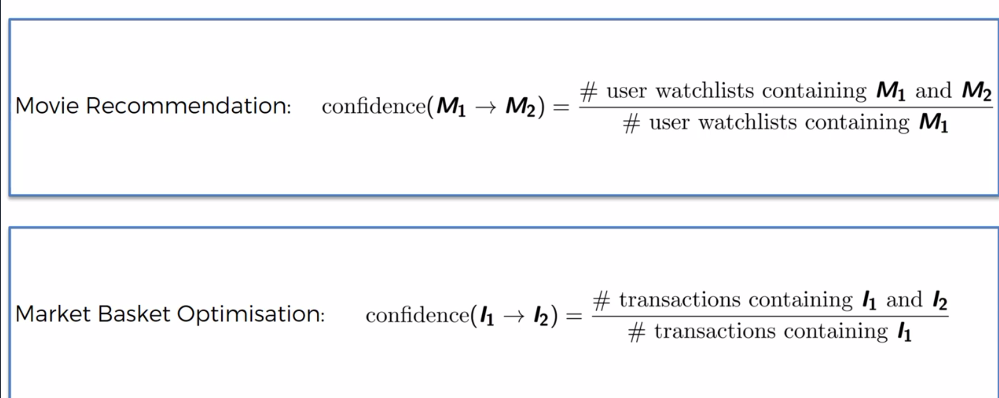
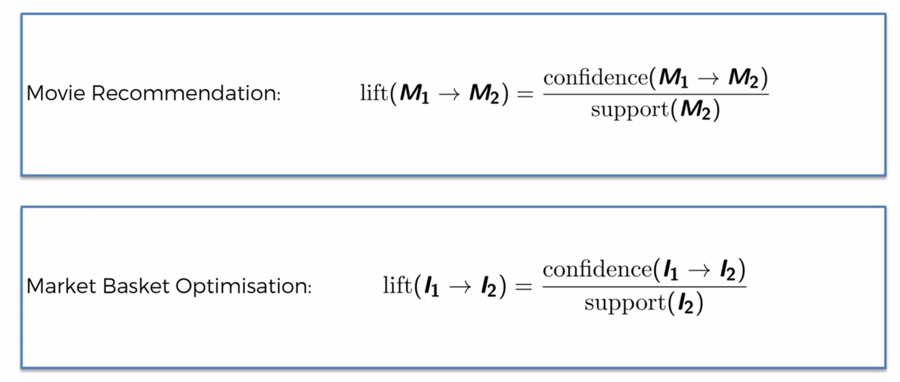
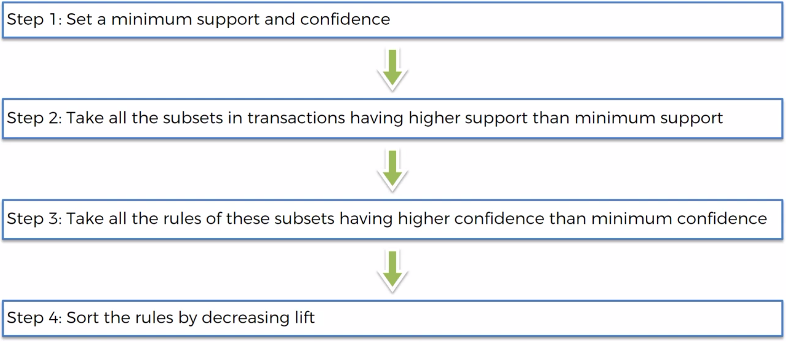

# Apriori

With have an example with people who bought also bought ... Why people by different types of things together ? Or also with movie recommandation or shopping basket.

The Apriori algo has three part:
- support
- confidence
- lift

## Examples

### Support

 

How many people watch M divide by the total of people which are watching movies

### Confidence

 

How many people watch M1 and M2 divide by the total of people who watched M1

### Lift

The lift is the confidence divide by the support

 

## Algorithm Steps

 

Let's start the practical example

The dataset contain transactions of customers during a week


```python
# Importing the libraries
import numpy as np
import matplotlib.pyplot as plt
import pandas as pd

# Data Preprocessing
dataset = pd.read_csv('Market_Basket_Optimisation.csv', header = None)
dataset.head(10)
```


<div>
<style scoped>
    .dataframe tbody tr th:only-of-type {
        vertical-align: middle;
    }

    .dataframe tbody tr th {
        vertical-align: top;
    }

    .dataframe thead th {
        text-align: right;
    }
</style>
<table border="1" class="dataframe">
  <thead>
    <tr style="text-align: right;">
      <th></th>
      <th>0</th>
      <th>1</th>
      <th>2</th>
      <th>3</th>
      <th>4</th>
      <th>5</th>
      <th>6</th>
      <th>7</th>
      <th>8</th>
      <th>9</th>
      <th>10</th>
      <th>11</th>
      <th>12</th>
      <th>13</th>
      <th>14</th>
      <th>15</th>
      <th>16</th>
      <th>17</th>
      <th>18</th>
      <th>19</th>
    </tr>
  </thead>
  <tbody>
    <tr>
      <th>0</th>
      <td>shrimp</td>
      <td>almonds</td>
      <td>avocado</td>
      <td>vegetables mix</td>
      <td>green grapes</td>
      <td>whole weat flour</td>
      <td>yams</td>
      <td>cottage cheese</td>
      <td>energy drink</td>
      <td>tomato juice</td>
      <td>low fat yogurt</td>
      <td>green tea</td>
      <td>honey</td>
      <td>salad</td>
      <td>mineral water</td>
      <td>salmon</td>
      <td>antioxydant juice</td>
      <td>frozen smoothie</td>
      <td>spinach</td>
      <td>olive oil</td>
    </tr>
    <tr>
      <th>1</th>
      <td>burgers</td>
      <td>meatballs</td>
      <td>eggs</td>
      <td>NaN</td>
      <td>NaN</td>
      <td>NaN</td>
      <td>NaN</td>
      <td>NaN</td>
      <td>NaN</td>
      <td>NaN</td>
      <td>NaN</td>
      <td>NaN</td>
      <td>NaN</td>
      <td>NaN</td>
      <td>NaN</td>
      <td>NaN</td>
      <td>NaN</td>
      <td>NaN</td>
      <td>NaN</td>
      <td>NaN</td>
    </tr>
    <tr>
      <th>2</th>
      <td>chutney</td>
      <td>NaN</td>
      <td>NaN</td>
      <td>NaN</td>
      <td>NaN</td>
      <td>NaN</td>
      <td>NaN</td>
      <td>NaN</td>
      <td>NaN</td>
      <td>NaN</td>
      <td>NaN</td>
      <td>NaN</td>
      <td>NaN</td>
      <td>NaN</td>
      <td>NaN</td>
      <td>NaN</td>
      <td>NaN</td>
      <td>NaN</td>
      <td>NaN</td>
      <td>NaN</td>
    </tr>
    <tr>
      <th>3</th>
      <td>turkey</td>
      <td>avocado</td>
      <td>NaN</td>
      <td>NaN</td>
      <td>NaN</td>
      <td>NaN</td>
      <td>NaN</td>
      <td>NaN</td>
      <td>NaN</td>
      <td>NaN</td>
      <td>NaN</td>
      <td>NaN</td>
      <td>NaN</td>
      <td>NaN</td>
      <td>NaN</td>
      <td>NaN</td>
      <td>NaN</td>
      <td>NaN</td>
      <td>NaN</td>
      <td>NaN</td>
    </tr>
    <tr>
      <th>4</th>
      <td>mineral water</td>
      <td>milk</td>
      <td>energy bar</td>
      <td>whole wheat rice</td>
      <td>green tea</td>
      <td>NaN</td>
      <td>NaN</td>
      <td>NaN</td>
      <td>NaN</td>
      <td>NaN</td>
      <td>NaN</td>
      <td>NaN</td>
      <td>NaN</td>
      <td>NaN</td>
      <td>NaN</td>
      <td>NaN</td>
      <td>NaN</td>
      <td>NaN</td>
      <td>NaN</td>
      <td>NaN</td>
    </tr>
    <tr>
      <th>5</th>
      <td>low fat yogurt</td>
      <td>NaN</td>
      <td>NaN</td>
      <td>NaN</td>
      <td>NaN</td>
      <td>NaN</td>
      <td>NaN</td>
      <td>NaN</td>
      <td>NaN</td>
      <td>NaN</td>
      <td>NaN</td>
      <td>NaN</td>
      <td>NaN</td>
      <td>NaN</td>
      <td>NaN</td>
      <td>NaN</td>
      <td>NaN</td>
      <td>NaN</td>
      <td>NaN</td>
      <td>NaN</td>
    </tr>
    <tr>
      <th>6</th>
      <td>whole wheat pasta</td>
      <td>french fries</td>
      <td>NaN</td>
      <td>NaN</td>
      <td>NaN</td>
      <td>NaN</td>
      <td>NaN</td>
      <td>NaN</td>
      <td>NaN</td>
      <td>NaN</td>
      <td>NaN</td>
      <td>NaN</td>
      <td>NaN</td>
      <td>NaN</td>
      <td>NaN</td>
      <td>NaN</td>
      <td>NaN</td>
      <td>NaN</td>
      <td>NaN</td>
      <td>NaN</td>
    </tr>
    <tr>
      <th>7</th>
      <td>soup</td>
      <td>light cream</td>
      <td>shallot</td>
      <td>NaN</td>
      <td>NaN</td>
      <td>NaN</td>
      <td>NaN</td>
      <td>NaN</td>
      <td>NaN</td>
      <td>NaN</td>
      <td>NaN</td>
      <td>NaN</td>
      <td>NaN</td>
      <td>NaN</td>
      <td>NaN</td>
      <td>NaN</td>
      <td>NaN</td>
      <td>NaN</td>
      <td>NaN</td>
      <td>NaN</td>
    </tr>
    <tr>
      <th>8</th>
      <td>frozen vegetables</td>
      <td>spaghetti</td>
      <td>green tea</td>
      <td>NaN</td>
      <td>NaN</td>
      <td>NaN</td>
      <td>NaN</td>
      <td>NaN</td>
      <td>NaN</td>
      <td>NaN</td>
      <td>NaN</td>
      <td>NaN</td>
      <td>NaN</td>
      <td>NaN</td>
      <td>NaN</td>
      <td>NaN</td>
      <td>NaN</td>
      <td>NaN</td>
      <td>NaN</td>
      <td>NaN</td>
    </tr>
    <tr>
      <th>9</th>
      <td>french fries</td>
      <td>NaN</td>
      <td>NaN</td>
      <td>NaN</td>
      <td>NaN</td>
      <td>NaN</td>
      <td>NaN</td>
      <td>NaN</td>
      <td>NaN</td>
      <td>NaN</td>
      <td>NaN</td>
      <td>NaN</td>
      <td>NaN</td>
      <td>NaN</td>
      <td>NaN</td>
      <td>NaN</td>
      <td>NaN</td>
      <td>NaN</td>
      <td>NaN</td>
      <td>NaN</td>
    </tr>
  </tbody>
</table>
</div>


```python
transactions = []
# Creating list of list
for i in range(0, 7501):
    transactions.append([str(dataset.values[i,j]) for j in range(0, 20)])
transactions[:3]
```


    [['shrimp',
      'almonds',
      'avocado',
      'vegetables mix',
      'green grapes',
      'whole weat flour',
      'yams',
      'cottage cheese',
      'energy drink',
      'tomato juice',
      'low fat yogurt',
      'green tea',
      'honey',
      'salad',
      'mineral water',
      'salmon',
      'antioxydant juice',
      'frozen smoothie',
      'spinach',
      'olive oil'],
     ['burgers',
      'meatballs',
      'eggs',
      'nan',
      'nan',
      'nan',
      'nan',
      'nan',
      'nan',
      'nan',
      'nan',
      'nan',
      'nan',
      'nan',
      'nan',
      'nan',
      'nan',
      'nan',
      'nan',
      'nan'],
     ['chutney',
      'nan',
      'nan',
      'nan',
      'nan',
      'nan',
      'nan',
      'nan',
      'nan',
      'nan',
      'nan',
      'nan',
      'nan',
      'nan',
      'nan',
      'nan',
      'nan',
      'nan',
      'nan',
      'nan']]


```python
# Training Apriori on the dataset
from templates.apyori import apriori
rules = apriori(transactions, min_support = 0.003, min_confidence = 0.2, min_lift = 3, min_length = 2)

# Visualising the results
results = list(rules)
```


```python
pd.DataFrame(results)
```


<div>
<style scoped>
    .dataframe tbody tr th:only-of-type {
        vertical-align: middle;
    }

    .dataframe tbody tr th {
        vertical-align: top;
    }

    .dataframe thead th {
        text-align: right;
    }
</style>
<table border="1" class="dataframe">
  <thead>
    <tr style="text-align: right;">
      <th></th>
      <th>items</th>
      <th>support</th>
      <th>ordered_statistics</th>
    </tr>
  </thead>
  <tbody>
    <tr>
      <th>0</th>
      <td>(light cream, chicken)</td>
      <td>0.004533</td>
      <td>[((light cream), (chicken), 0.2905982905982905...</td>
    </tr>
    <tr>
      <th>1</th>
      <td>(escalope, mushroom cream sauce)</td>
      <td>0.005733</td>
      <td>[((mushroom cream sauce), (escalope), 0.300699...</td>
    </tr>
    <tr>
      <th>2</th>
      <td>(pasta, escalope)</td>
      <td>0.005866</td>
      <td>[((pasta), (escalope), 0.3728813559322034, 4.7...</td>
    </tr>
    <tr>
      <th>3</th>
      <td>(fromage blanc, honey)</td>
      <td>0.003333</td>
      <td>[((fromage blanc), (honey), 0.2450980392156863...</td>
    </tr>
    <tr>
      <th>4</th>
      <td>(herb &amp; pepper, ground beef)</td>
      <td>0.015998</td>
      <td>[((herb &amp; pepper), (ground beef), 0.3234501347...</td>
    </tr>
    <tr>
      <th>5</th>
      <td>(tomato sauce, ground beef)</td>
      <td>0.005333</td>
      <td>[((tomato sauce), (ground beef), 0.37735849056...</td>
    </tr>
    <tr>
      <th>6</th>
      <td>(light cream, olive oil)</td>
      <td>0.003200</td>
      <td>[((light cream), (olive oil), 0.20512820512820...</td>
    </tr>
    <tr>
      <th>7</th>
      <td>(whole wheat pasta, olive oil)</td>
      <td>0.007999</td>
      <td>[((whole wheat pasta), (olive oil), 0.27149321...</td>
    </tr>
    <tr>
      <th>8</th>
      <td>(pasta, shrimp)</td>
      <td>0.005066</td>
      <td>[((pasta), (shrimp), 0.3220338983050847, 4.506...</td>
    </tr>
    <tr>
      <th>9</th>
      <td>(milk, spaghetti, avocado)</td>
      <td>0.003333</td>
      <td>[((spaghetti, avocado), (milk), 0.416666666666...</td>
    </tr>
    <tr>
      <th>10</th>
      <td>(milk, burgers, cake)</td>
      <td>0.003733</td>
      <td>[((milk, cake), (burgers), 0.27999999999999997...</td>
    </tr>
    <tr>
      <th>11</th>
      <td>(turkey, chocolate, burgers)</td>
      <td>0.003066</td>
      <td>[((turkey, chocolate), (burgers), 0.2705882352...</td>
    </tr>
    <tr>
      <th>12</th>
      <td>(turkey, milk, burgers)</td>
      <td>0.003200</td>
      <td>[((turkey, milk), (burgers), 0.282352941176470...</td>
    </tr>
    <tr>
      <th>13</th>
      <td>(cake, frozen vegetables, tomatoes)</td>
      <td>0.003066</td>
      <td>[((cake, frozen vegetables), (tomatoes), 0.298...</td>
    </tr>
    <tr>
      <th>14</th>
      <td>(spaghetti, cereals, ground beef)</td>
      <td>0.003066</td>
      <td>[((cereals, ground beef), (spaghetti), 0.67647...</td>
    </tr>
    <tr>
      <th>15</th>
      <td>(milk, chicken, ground beef)</td>
      <td>0.003866</td>
      <td>[((chicken, ground beef), (milk), 0.4084507042...</td>
    </tr>
    <tr>
      <th>16</th>
      <td>(light cream, chicken, nan)</td>
      <td>0.004533</td>
      <td>[((light cream, nan), (chicken), 0.29059829059...</td>
    </tr>
    <tr>
      <th>17</th>
      <td>(milk, chicken, olive oil)</td>
      <td>0.003600</td>
      <td>[((milk, chicken), (olive oil), 0.243243243243...</td>
    </tr>
    <tr>
      <th>18</th>
      <td>(chicken, spaghetti, olive oil)</td>
      <td>0.003466</td>
      <td>[((chicken, spaghetti), (olive oil), 0.2015503...</td>
    </tr>
    <tr>
      <th>19</th>
      <td>(shrimp, chocolate, frozen vegetables)</td>
      <td>0.005333</td>
      <td>[((chocolate, frozen vegetables), (shrimp), 0....</td>
    </tr>
    <tr>
      <th>20</th>
      <td>(herb &amp; pepper, chocolate, ground beef)</td>
      <td>0.003999</td>
      <td>[((herb &amp; pepper, chocolate), (ground beef), 0...</td>
    </tr>
    <tr>
      <th>21</th>
      <td>(milk, chocolate, soup)</td>
      <td>0.003999</td>
      <td>[((chocolate, soup), (milk), 0.394736842105263...</td>
    </tr>
    <tr>
      <th>22</th>
      <td>(spaghetti, ground beef, cooking oil)</td>
      <td>0.004799</td>
      <td>[((ground beef, cooking oil), (spaghetti), 0.5...</td>
    </tr>
    <tr>
      <th>23</th>
      <td>(herb &amp; pepper, eggs, ground beef)</td>
      <td>0.004133</td>
      <td>[((eggs, ground beef), (herb &amp; pepper), 0.2066...</td>
    </tr>
    <tr>
      <th>24</th>
      <td>(red wine, eggs, spaghetti)</td>
      <td>0.003733</td>
      <td>[((red wine, eggs), (spaghetti), 0.52830188679...</td>
    </tr>
    <tr>
      <th>25</th>
      <td>(escalope, mushroom cream sauce, nan)</td>
      <td>0.005733</td>
      <td>[((mushroom cream sauce, nan), (escalope), 0.3...</td>
    </tr>
    <tr>
      <th>26</th>
      <td>(pasta, escalope, nan)</td>
      <td>0.005866</td>
      <td>[((pasta, nan), (escalope), 0.3728813559322034...</td>
    </tr>
    <tr>
      <th>27</th>
      <td>(herb &amp; pepper, french fries, ground beef)</td>
      <td>0.003200</td>
      <td>[((french fries, ground beef), (herb &amp; pepper)...</td>
    </tr>
    <tr>
      <th>28</th>
      <td>(fromage blanc, honey, nan)</td>
      <td>0.003333</td>
      <td>[((fromage blanc, nan), (honey), 0.24509803921...</td>
    </tr>
    <tr>
      <th>29</th>
      <td>(green tea, tomatoes, frozen vegetables)</td>
      <td>0.003333</td>
      <td>[((green tea, frozen vegetables), (tomatoes), ...</td>
    </tr>
    <tr>
      <th>...</th>
      <td>...</td>
      <td>...</td>
      <td>...</td>
    </tr>
    <tr>
      <th>124</th>
      <td>(milk, nan, olive oil, spaghetti)</td>
      <td>0.007199</td>
      <td>[((milk, nan, spaghetti), (olive oil), 0.20300...</td>
    </tr>
    <tr>
      <th>125</th>
      <td>(milk, nan, tomatoes, soup)</td>
      <td>0.003066</td>
      <td>[((milk, nan, tomatoes), (soup), 0.21904761904...</td>
    </tr>
    <tr>
      <th>126</th>
      <td>(milk, whole wheat pasta, nan, spaghetti)</td>
      <td>0.003999</td>
      <td>[((whole wheat pasta, nan, spaghetti), (milk),...</td>
    </tr>
    <tr>
      <th>127</th>
      <td>(mineral water, nan, olive oil, soup)</td>
      <td>0.005199</td>
      <td>[((mineral water, nan, soup), (olive oil), 0.2...</td>
    </tr>
    <tr>
      <th>128</th>
      <td>(whole wheat pasta, mineral water, nan, olive ...</td>
      <td>0.003866</td>
      <td>[((whole wheat pasta, mineral water, nan), (ol...</td>
    </tr>
    <tr>
      <th>129</th>
      <td>(nan, pancakes, olive oil, spaghetti)</td>
      <td>0.005066</td>
      <td>[((nan, pancakes, spaghetti), (olive oil), 0.2...</td>
    </tr>
    <tr>
      <th>130</th>
      <td>(tomatoes, nan, olive oil, spaghetti)</td>
      <td>0.004399</td>
      <td>[((nan, olive oil, tomatoes), (spaghetti), 0.6...</td>
    </tr>
    <tr>
      <th>131</th>
      <td>(whole wheat rice, nan, tomatoes, spaghetti)</td>
      <td>0.003066</td>
      <td>[((whole wheat rice, nan, spaghetti), (tomatoe...</td>
    </tr>
    <tr>
      <th>132</th>
      <td>(chocolate, nan, mineral water, ground beef, e...</td>
      <td>0.003999</td>
      <td>[((chocolate, eggs, mineral water, nan), (grou...</td>
    </tr>
    <tr>
      <th>133</th>
      <td>(chocolate, nan, mineral water, frozen vegetab...</td>
      <td>0.003333</td>
      <td>[((chocolate, mineral water, nan, frozen veget...</td>
    </tr>
    <tr>
      <th>134</th>
      <td>(chocolate, nan, spaghetti, frozen vegetables,...</td>
      <td>0.003066</td>
      <td>[((chocolate, nan, ground beef, frozen vegetab...</td>
    </tr>
    <tr>
      <th>135</th>
      <td>(milk, chocolate, nan, mineral water, frozen v...</td>
      <td>0.003999</td>
      <td>[((chocolate, mineral water, nan, frozen veget...</td>
    </tr>
    <tr>
      <th>136</th>
      <td>(milk, chocolate, nan, spaghetti, frozen veget...</td>
      <td>0.003466</td>
      <td>[((chocolate, nan, frozen vegetables, spaghett...</td>
    </tr>
    <tr>
      <th>137</th>
      <td>(chocolate, nan, shrimp, mineral water, frozen...</td>
      <td>0.003200</td>
      <td>[((chocolate, mineral water, nan, frozen veget...</td>
    </tr>
    <tr>
      <th>138</th>
      <td>(chocolate, nan, spaghetti, mineral water, oli...</td>
      <td>0.003866</td>
      <td>[((chocolate, mineral water, nan, spaghetti), ...</td>
    </tr>
    <tr>
      <th>139</th>
      <td>(chocolate, nan, spaghetti, shrimp, mineral wa...</td>
      <td>0.003466</td>
      <td>[((chocolate, mineral water, nan, spaghetti), ...</td>
    </tr>
    <tr>
      <th>140</th>
      <td>(milk, nan, mineral water, frozen vegetables, ...</td>
      <td>0.003733</td>
      <td>[((eggs, mineral water, nan, frozen vegetables...</td>
    </tr>
    <tr>
      <th>141</th>
      <td>(milk, nan, spaghetti, mineral water, frozen s...</td>
      <td>0.003200</td>
      <td>[((frozen smoothie, mineral water, nan, spaghe...</td>
    </tr>
    <tr>
      <th>142</th>
      <td>(milk, nan, mineral water, frozen vegetables, ...</td>
      <td>0.003733</td>
      <td>[((mineral water, nan, ground beef, frozen veg...</td>
    </tr>
    <tr>
      <th>143</th>
      <td>(milk, nan, spaghetti, frozen vegetables, grou...</td>
      <td>0.003066</td>
      <td>[((milk, nan, ground beef, frozen vegetables),...</td>
    </tr>
    <tr>
      <th>144</th>
      <td>(nan, spaghetti, mineral water, frozen vegetab...</td>
      <td>0.004399</td>
      <td>[((mineral water, nan, frozen vegetables, spag...</td>
    </tr>
    <tr>
      <th>145</th>
      <td>(milk, nan, mineral water, olive oil, frozen v...</td>
      <td>0.003333</td>
      <td>[((milk, mineral water, nan, frozen vegetables...</td>
    </tr>
    <tr>
      <th>146</th>
      <td>(milk, nan, mineral water, frozen vegetables, ...</td>
      <td>0.003066</td>
      <td>[((milk, mineral water, nan, frozen vegetables...</td>
    </tr>
    <tr>
      <th>147</th>
      <td>(milk, nan, spaghetti, mineral water, frozen v...</td>
      <td>0.004533</td>
      <td>[((milk, mineral water, nan, spaghetti), (froz...</td>
    </tr>
    <tr>
      <th>148</th>
      <td>(nan, spaghetti, shrimp, mineral water, frozen...</td>
      <td>0.003333</td>
      <td>[((mineral water, nan, frozen vegetables, spag...</td>
    </tr>
    <tr>
      <th>149</th>
      <td>(nan, spaghetti, mineral water, frozen vegetab...</td>
      <td>0.003066</td>
      <td>[((mineral water, nan, frozen vegetables, spag...</td>
    </tr>
    <tr>
      <th>150</th>
      <td>(nan, spaghetti, mineral water, olive oil, gro...</td>
      <td>0.003066</td>
      <td>[((mineral water, nan, olive oil, spaghetti), ...</td>
    </tr>
    <tr>
      <th>151</th>
      <td>(nan, spaghetti, mineral water, ground beef, t...</td>
      <td>0.003066</td>
      <td>[((mineral water, nan, ground beef, tomatoes),...</td>
    </tr>
    <tr>
      <th>152</th>
      <td>(milk, nan, spaghetti, mineral water, olive oil)</td>
      <td>0.003333</td>
      <td>[((milk, mineral water, nan, spaghetti), (oliv...</td>
    </tr>
    <tr>
      <th>153</th>
      <td>(milk, nan, spaghetti, mineral water, tomatoes)</td>
      <td>0.003333</td>
      <td>[((milk, mineral water, nan, spaghetti), (toma...</td>
    </tr>
  </tbody>
</table>
<p>154 rows × 3 columns</p>
</div>


```python

```
