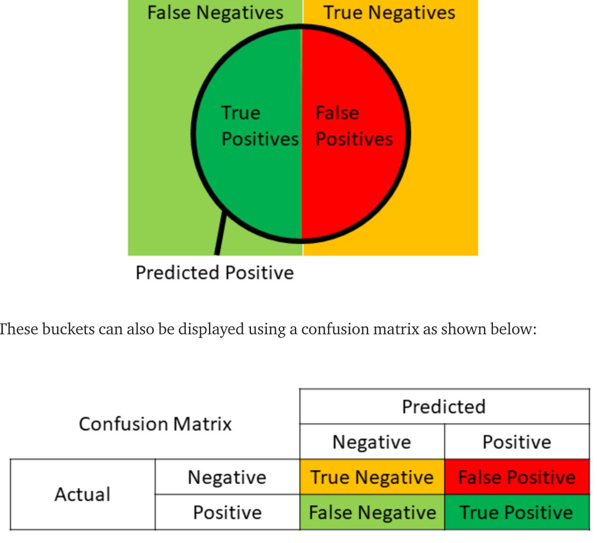

# Natural Language Processing 

__NLP uses:__

- Sentiment analysis
- Predict genre of book
- Question answering
- Machine translator or speech recognition

__Librairies:__ Spacy, NLTK ...

__Bag of Words__:

Very popular NLP model used to preprocess the texts to classify before fitting the classification algorithms on the observations containing the texts.

It involves two things:

- A vocabulary of known words
- A measure of the presence of known words

In this section, we will understand and learn how to:

- Cleans text to prepare them for machine learning models
- Create a Bag of words model
- Apply machine learning models onto this bag of worlds model.

## Practical Example

The dataset contains reviews of a restaurant and the goal is to separate the good and bad reviews.

The tsv format is use because the tab separator in our context use is the best to use (a comma will create other columns).


```python
# Importing the libraries
import numpy as np
import matplotlib.pyplot as plt
import pandas as pd

# Importing the dataset - Quoting for ingnoring double quotes
dataset = pd.read_csv('Restaurant_Reviews.tsv', delimiter = '\t', quoting = 3)
dataset.head(5)
```


<div>
<style scoped>
    .dataframe tbody tr th:only-of-type {
        vertical-align: middle;
    }

    .dataframe tbody tr th {
        vertical-align: top;
    }

    .dataframe thead th {
        text-align: right;
    }
</style>
<table border="1" class="dataframe">
  <thead>
    <tr style="text-align: right;">
      <th></th>
      <th>Review</th>
      <th>Liked</th>
    </tr>
  </thead>
  <tbody>
    <tr>
      <th>0</th>
      <td>Wow... Loved this place.</td>
      <td>1</td>
    </tr>
    <tr>
      <th>1</th>
      <td>Crust is not good.</td>
      <td>0</td>
    </tr>
    <tr>
      <th>2</th>
      <td>Not tasty and the texture was just nasty.</td>
      <td>0</td>
    </tr>
    <tr>
      <th>3</th>
      <td>Stopped by during the late May bank holiday of...</td>
      <td>1</td>
    </tr>
    <tr>
      <th>4</th>
      <td>The selection on the menu was great and so wer...</td>
      <td>1</td>
    </tr>
  </tbody>
</table>
</div>


## Text cleaning to Bag of words

The goal is to only get the relevant words and avoid punctuation, numbers, capitals or stop words and also apply stemming to get the root of a word and avoid different version of a word.

At the end we will apply the tokenization process to create our bag of words by splitting the text to a matrix of words (in columns).

---

## __Step 1:__ Only keeping the letters and remove punctuation and numbers

Using regex and sub method using a regular expression `^a-zA-Z]`

```python
import re

# adding the space to replace the removed characters
review = re.sub('[^a-zA-Z]', ' ', dataset['Review'][0])
```


```python
import re
review = re.sub('[^a-zA-Z]', ' ', dataset['Review'][0])
print("Before : {}".format(dataset['Review'][0]))
print("After : {}".format(review))
```

    Before : Wow... Loved this place.
    After : Wow    Loved this place 


---

## __Step 2:__ Putting all the letters to lowercase
```python
#To lowercase
review = review.lower()
```


```python
review_lower = review.lower()

print("Putting all the letters to lowercase...\n")
print("Before : {}".format(re.sub('[^a-zA-Z]', ' ', dataset['Review'][0])))
print("After : {}".format(review_lower))
```

    Putting all the letters to lowercase...
    
    Before : Wow    Loved this place 
    After : wow    loved this place 


---

## __Step 3:__ Remove the non significant words (stopwords)

If we are using the first line we see that words like `this` is not really usefull for machine learning algo.

To remove the stopwords we are going to use yhe __nltk__ library and its stopwords list.

For each review we will split the text in several words and check if each of the words are in the stopwords list.

```python
import nltk

# Importing and dowload the list of useless words
nltk.download('stopwords')

#split the text
review = review.split()

# removing stop words - set function is used find faster stop words matches
review = [word for word in review if not word in set(stopwords.words('english'))]

```


```python
review_splitted = review.split()

print("Splitting text...\n")

print("Before : {}".format(re.sub('[^a-zA-Z]', ' ', dataset['Review'][0]).lower()))
print("After : {}".format(review_splitted))
```

    Splitting text...
    
    Before : wow    loved this place 
    After : ['Wow', 'Loved', 'this', 'place']


```python
from nltk.corpus import stopwords

review_no_stop_words = [word for word in review_splitted if not word in set(stopwords.words('english'))]
print("Removing stopwords...\n")
print("Before : {}".format(review_splitted))
print("After : {}".format(review_no_stop_words))
```

    Removing stopwords...
    
    Before : ['Wow', 'Loved', 'this', 'place']
    After : ['Wow', 'Loved', 'place']


---

## __Step 4:__ Stemming

To get the root of a word to avoid the different versions.

```python
# importing PorterStemmer class
from nltk.stem.porter import PorterStemmer

# Create an object of the Porter stemmer
ps = PorterStemmer()

# Applying steamer to our list of words
review = [ps.stem(word) for word in review if not word in set(stopwords.words('english'))]

# convert our list to text
review = ' '.join(review)

```


```python
from nltk.stem.porter import PorterStemmer

ps = PorterStemmer()

review_stemmed_no_stop_words = [ps.stem(word) for word in review_no_stop_words if not word in set(stopwords.words('english'))]
print("Stemming ...\n")
print("Before : {}".format(review_no_stop_words))
print("After : {}".format(review_stemmed_no_stop_words))
```

    Stemming ...
    
    Before : ['Wow', 'Loved', 'place']
    After : ['wow', 'love', 'place']


```python
review_text_stemmed_no_stop_words = ' '.join(review_stemmed_no_stop_words)

print("Recreating text on each line ...\n")
print("Before : {}".format(review_stemmed_no_stop_words))
print("After : {}".format(review_text_stemmed_no_stop_words))
```

    Recreating text on each line ...
    
    Before : ['wow', 'love', 'place']
    After : wow love place


---

## Full code for cleaning process (for each review)
 


```python
# Cleaning the texts
import re
import nltk
nltk.download('stopwords')
from nltk.corpus import stopwords
from nltk.stem.porter import PorterStemmer
corpus = []
for i in range(0, 1000):
    review = re.sub('[^a-zA-Z]', ' ', dataset['Review'][i])
    review = review.lower()
    review = review.split()
    ps = PorterStemmer()
    review = [ps.stem(word) for word in review if not word in set(stopwords.words('english'))]
    review = ' '.join(review)
    
    # appending clean review to our list of common words 
    corpus.append(review)
    
print("************* Before cleaning... ************* \n ")
print(' \n\n'.join(dataset['Review'][:10].tolist()))
print("\n\n\n")
print("************* After cleaning ... ************* \n")
print(' \n\n'.join(corpus[:10]))
```

    [nltk_data] Downloading package stopwords to /Users/yanni-benoit-
    [nltk_data]     iyeze/nltk_data...
    [nltk_data]   Package stopwords is already up-to-date!


    ************* Before cleaning... ************* 
     
    Wow... Loved this place. 
    
    Crust is not good. 
    
    Not tasty and the texture was just nasty. 
    
    Stopped by during the late May bank holiday off Rick Steve recommendation and loved it. 
    
    The selection on the menu was great and so were the prices. 
    
    Now I am getting angry and I want my damn pho. 
    
    Honeslty it didn't taste THAT fresh.) 
    
    The potatoes were like rubber and you could tell they had been made up ahead of time being kept under a warmer. 
    
    The fries were great too. 
    
    A great touch.
    
    
    
    
    ************* After cleaning ... ************* 
    
    wow love place 
    
    crust good 
    
    tasti textur nasti 
    
    stop late may bank holiday rick steve recommend love 
    
    select menu great price 
    
    get angri want damn pho 
    
    honeslti tast fresh 
    
    potato like rubber could tell made ahead time kept warmer 
    
    fri great 
    
    great touch


---

## Step 5: Creating the bag of words model

The bag of words model is used after creating the corpus and to create it you have to take all disctinct words and create on column for each word (__tokenization__). 
That will create a matrix of the reviews and word in column, if a line contain a word there will be a 1 and 0 instead.

We need to create this model to use a machine learning model because the ml model will be trained on the reviews and help it to understand the correlation (review <-> word) for the classification : __we use independent variable (word) to predict dependent variable (good or bad).__

We use the [__CountVectorizer__](https://scikit-learn.org/stable/modules/generated/sklearn.feature_extraction.text.CountVectorizer.html) method of the __sklearn library__ to reproduce the tokenization process

We already cleaned the text before so we don't need to use every parameters. 
That's should be more useful if you wand to apply more cleaning steps for complicated text like scrapped text.


```python
# importing the CountVectorizer method
from sklearn.feature_extraction.text import CountVectorizer

# Creating CountVectorizer object - MaxFeatures is used to remove non relevant words (we have 1500 column).
cv = CountVectorizer(max_features = 1500)

# Fitting our corpus using tokenisation - Matrix of features or independent variable
X = cv.fit_transform(corpus).toarray()

#Selecting dependent variable from dataset - Reviews likes
y = dataset.iloc[:, 1].values
```


```python
# Creating the Bag of Words model
from sklearn.feature_extraction.text import CountVectorizer
cv = CountVectorizer(max_features = 1500)
X = cv.fit_transform(corpus).toarray()
y = dataset.iloc[:, 1].values

print("************* Matrix of feature... ************* \n ")
print(X[:5])

print("************* Independant variable... ************* \n ")

print(y[:5])
```

    ************* Matrix of feature... ************* 
     
    [[0 0 0 ... 0 0 0]
     [0 0 0 ... 0 0 0]
     [0 0 0 ... 0 0 0]
     [0 0 0 ... 0 0 0]
     [0 0 0 ... 0 0 0]]
    ************* Independant variable... ************* 
     
    [1 0 0 1 1]


---

## Step 6: Applying a Machine Learning Model

The most common models used for NLP are Naive Bayes, Decision Trees and Random forest models.

For our example we will try the Naive Bayes model.

```python

# Splitting the dataset into the Training set and Test set
from sklearn.cross_validation import train_test_split
X_train, X_test, y_train, y_test = train_test_split(X, y, test_size = 0.20, random_state = 0)

# Fitting Naive Bayes to the Training set
from sklearn.naive_bayes import GaussianNB
classifier = GaussianNB()
classifier.fit(X_train, y_train)

# Predicting the Test set results
y_pred = classifier.predict(X_test)


# Making the Confusion Matrix
from sklearn.metrics import confusion_matrix
cm = confusion_matrix(y_test, y_pred)

```


```python
# Splitting the dataset into the Training set and Test set
from sklearn.model_selection import train_test_split
X_train, X_test, y_train, y_test = train_test_split(X, y, test_size = 0.20, random_state = 0)

# Fitting Naive Bayes to the Training set
from sklearn.naive_bayes import GaussianNB
classifier = GaussianNB()
classifier.fit(X_train, y_train)

# Predicting the Test set results
y_pred = classifier.predict(X_test)
print("************* Prediction... ************* \n ")
print(y_pred[:5])

# Making the Confusion Matrix
from sklearn.metrics import confusion_matrix
cm = confusion_matrix(y_test, y_pred)

print("************* Confusion Matrix... ************* \n ")
cm


```

    ************* Prediction... ************* 
     
    [1 1 1 0 0]
    ************* Confusion Matrix... ************* 
     


    array([[55, 42],
           [12, 91]])


We got 55 + 91 good results so 73%

## Homework challenge 
```
Hello students,

congratulations for having completed Part 7 - Natural Language Processing.

If you are up for some practical activities, here is a little challenge:

1. Run the other classification models we made in Part 3 - Classification, other than the one we used in the last tutorial.

2. Evaluate the performance of each of these models. Try to beat the Accuracy obtained in the tutorial. But remember, Accuracy is not enough, so you should also look at other performance metrics like Precision (measuring exactness), Recall (measuring completeness) and the F1 Score (compromise between Precision and Recall). Please find below these metrics formulas (TP = # True Positives, TN = # True Negatives, FP = # False Positives, FN = # False Negatives):

Accuracy = (TP + TN) / (TP + TN + FP + FN)

Precision = TP / (TP + FP)

Recall = TP / (TP + FN)

F1 Score = 2 * Precision * Recall / (Precision + Recall)

3. Try even other classification models that we haven't covered in Part 3 - Classification. Good ones for NLP include:

    CART
    C5.0
    Maximum Entropy

```

## Solution

To slove this homework challenge we will first:

Create function to evaluate each model using performance metrics:
   
    - Accuracy
    - Precision (measuring exactness)
    - Recall (measuring completeness)
    - F1 Score (compromise between Precision and Recall)

The calculation of these metrics require arguments:

    - True Positives (TP)
    - True Negatives (TN)
    - False Positive (FP)
    - False Negative (FN)





```python
# Find aguments and calculate metrics
def find_TP(y_true, y_pred):
    return sum((y_true == 1) & (y_pred == 1))
def find_FN(y_true, y_pred):
    return sum((y_true == 1) & (y_pred == 0))
def find_FP(y_true, y_pred):
    return sum((y_true == 0) & (y_pred == 1))
def find_TN(y_true, y_pred):
    return sum((y_true == 0) & (y_pred == 0))

def find_conf_matrix_values(y_true,y_pred):
    TP = find_TP(y_true,y_pred)
    FN = find_FN(y_true,y_pred)
    FP = find_FP(y_true,y_pred)
    TN = find_TN(y_true,y_pred)
    return TP,FN,FP,TN

def my_scoring(y_true, y_pred):
    scoring = {}
    TP,FN,FP,TN = find_conf_matrix_values(y_true,y_pred) 
    scoring['accuracy'] = (TP + TN) / (TP + TN + FP + FN)
    scoring['precision'] = TP / (TP + FP)
    scoring['recall'] =  TP / (TP + FN)
    scoring['F1_score'] = 2 * scoring['precision'] * scoring['recall']/ (scoring['precision'] + scoring['recall'])   
    return scoring
```


```python
results =[]
## Calculating metrics
print("************* Scoring ... ************* \n ")

scoring = my_scoring(y_test, y_pred)
scoring.update({'model': 'Naïve Bayes'})
print(scoring)
results.append(scoring)
```

    ************* Scoring ... ************* 
     
    {'accuracy': 0.73, 'precision': 0.6842105263157895, 'recall': 0.883495145631068, 'F1_score': 0.7711864406779663, 'model': 'Naïve Bayes'}


## Random Forest - Entropy


```python
# Random Forest
from sklearn.ensemble import RandomForestClassifier
classifier = RandomForestClassifier(n_estimators = 10, criterion = 'entropy', random_state = 0)
classifier.fit(X_train, y_train)

# Predicting the Test set results
y_pred = classifier.predict(X_test)
print("************* Dataset... ************* \n ")
print(y_test[:5])
print("************* Prediction... ************* \n ")
print(y_pred[:5])

# Making the Confusion Matrix
from sklearn.metrics import confusion_matrix
cm = confusion_matrix(y_test, y_pred)

print("************* Confusion Matrix... ************* \n ")
print(cm)

## Calculating metrics
print("************* Scoring ... ************* \n ")

scoring = my_scoring(y_test, y_pred)
scoring.update({'model': 'Random Forest - Entropy'})
print(scoring)
results.append(scoring)
```

    ************* Dataset... ************* 
     
    [0 0 0 0 0]
    ************* Prediction... ************* 
     
    [0 0 0 0 0]
    ************* Confusion Matrix... ************* 
     
    [[87 10]
     [46 57]]
    ************* Scoring ... ************* 
     
    {'accuracy': 0.72, 'precision': 0.8507462686567164, 'recall': 0.5533980582524272, 'F1_score': 0.6705882352941177, 'model': 'Random Forest - Entropy'}


## Random Forest - Gini


```python
# Random Forest
from sklearn.ensemble import RandomForestClassifier
classifier = RandomForestClassifier(n_estimators = 10, criterion = 'gini', random_state = 0)
classifier.fit(X_train, y_train)

# Predicting the Test set results
y_pred = classifier.predict(X_test)
print("************* Dataset... ************* \n ")
print(y_test[:5])
print("************* Prediction... ************* \n ")
print(y_pred[:5])

# Making the Confusion Matrix
from sklearn.metrics import confusion_matrix
cm = confusion_matrix(y_test, y_pred)

print("************* Confusion Matrix... ************* \n ")
print(cm)

## Calculating metrics
print("************* Scoring ... ************* \n ")

scoring = my_scoring(y_test, y_pred)
scoring.update({'model': 'Random Forest - Gini'})
print(scoring)
results.append(scoring)
```

    ************* Dataset... ************* 
     
    [0 0 0 0 0]
    ************* Prediction... ************* 
     
    [0 0 1 0 1]
    ************* Confusion Matrix... ************* 
     
    [[82 15]
     [48 55]]
    ************* Scoring ... ************* 
     
    {'accuracy': 0.685, 'precision': 0.7857142857142857, 'recall': 0.5339805825242718, 'F1_score': 0.6358381502890172, 'model': 'Random Forest - Gini'}


## Decision Tree - Entropy


```python
# Decision Tree - Entropy
from sklearn.tree import DecisionTreeClassifier
classifier = DecisionTreeClassifier(criterion = 'entropy', random_state = 0)
classifier.fit(X_train, y_train)

# Predicting the Test set results
y_pred = classifier.predict(X_test)
print("************* Prediction... ************* \n ")
print(y_pred[:5])

# Making the Confusion Matrix
from sklearn.metrics import confusion_matrix
cm = confusion_matrix(y_test, y_pred)

print("************* Confusion Matrix... ************* \n ")
print(cm)


## Calculating metrics
print("************* Scoring ... ************* \n ")
scoring = my_scoring(y_test, y_pred)
scoring.update({'model': 'Decision Tree - Entropy'})
print(scoring)
results.append(scoring)
```

    ************* Prediction... ************* 
     
    [0 0 1 0 1]
    ************* Confusion Matrix... ************* 
     
    [[74 23]
     [35 68]]
    ************* Scoring ... ************* 
     
    {'accuracy': 0.71, 'precision': 0.7472527472527473, 'recall': 0.6601941747572816, 'F1_score': 0.7010309278350515, 'model': 'Decision Tree - Entropy'}


## Decision Tree - Gini


```python
# Decision Tree - Entropy
from sklearn.tree import DecisionTreeClassifier
classifier = DecisionTreeClassifier(criterion = 'gini', random_state = 0)
classifier.fit(X_train, y_train)

# Predicting the Test set results
y_pred = classifier.predict(X_test)
print("************* Prediction... ************* \n ")
print(y_pred[:5])

# Making the Confusion Matrix
from sklearn.metrics import confusion_matrix
cm = confusion_matrix(y_test, y_pred)

print("************* Confusion Matrix... ************* \n ")
print(cm)


## Calculating metrics
print("************* Scoring ... ************* \n ")
scoring = my_scoring(y_test, y_pred)
scoring.update({'model': 'Decision Tree - Gini'})
print(scoring)
results.append(scoring)
```

    ************* Prediction... ************* 
     
    [0 0 1 0 1]
    ************* Confusion Matrix... ************* 
     
    [[71 26]
     [44 59]]
    ************* Scoring ... ************* 
     
    {'accuracy': 0.65, 'precision': 0.6941176470588235, 'recall': 0.5728155339805825, 'F1_score': 0.6276595744680851, 'model': 'Decision Tree - Gini'}


## Kernel SVM


```python
# Kernel SVM - Kernel RBF
from sklearn.svm import SVC
classifier = SVC(kernel = 'rbf', random_state = 0)
classifier.fit(X_train, y_train)

# Predicting the Test set results
y_pred = classifier.predict(X_test)
print("************* Prediction... ************* \n ")
print(y_pred[:5])

# Making the Confusion Matrix
from sklearn.metrics import confusion_matrix
cm = confusion_matrix(y_test, y_pred)

print("************* Confusion Matrix... ************* \n ")
print(cm)

## Calculating metrics
print("************* Scoring ... ************* \n ")

scoring = my_scoring(y_test, y_pred)
scoring.update({'model': 'Kernel SVM'})
print(scoring)
results.append(scoring)
```

    /usr/local/lib/python3.7/site-packages/sklearn/svm/base.py:196: FutureWarning: The default value of gamma will change from 'auto' to 'scale' in version 0.22 to account better for unscaled features. Set gamma explicitly to 'auto' or 'scale' to avoid this warning.
      "avoid this warning.", FutureWarning)


    ************* Prediction... ************* 
     
    [0 0 0 0 0]
    ************* Confusion Matrix... ************* 
     
    [[ 97   0]
     [103   0]]
    ************* Scoring ... ************* 
     
    {'accuracy': 0.485, 'precision': nan, 'recall': 0.0, 'F1_score': nan, 'model': 'Kernel SVM'}


    /usr/local/lib/python3.7/site-packages/ipykernel_launcher.py:22: RuntimeWarning: invalid value encountered in long_scalars


## SVM


```python
# SVM
from sklearn.svm import SVC
classifier = SVC(kernel = 'linear', random_state = 0)
classifier.fit(X_train, y_train)

# Predicting the Test set results
y_pred = classifier.predict(X_test)
print("************* Prediction... ************* \n ")
print(y_pred[:5])

# Making the Confusion Matrix
from sklearn.metrics import confusion_matrix
cm = confusion_matrix(y_test, y_pred)

print("************* Confusion Matrix... ************* \n ")
print(cm)

## Calculating metrics
print("************* Scoring ... ************* \n ")

scoring = my_scoring(y_test, y_pred)
scoring.update({'model': 'SVM'})
print(scoring)
results.append(scoring)
```

    ************* Prediction... ************* 
     
    [0 0 0 0 0]
    ************* Confusion Matrix... ************* 
     
    [[74 23]
     [33 70]]
    ************* Scoring ... ************* 
     
    {'accuracy': 0.72, 'precision': 0.7526881720430108, 'recall': 0.6796116504854369, 'F1_score': 0.7142857142857143, 'model': 'SVM'}


## K - NN


```python
# K-NN
from sklearn.neighbors import KNeighborsClassifier
classifier = KNeighborsClassifier(n_neighbors = 5, metric = 'minkowski', p = 2)
classifier.fit(X_train, y_train)

# Predicting the Test set results
y_pred = classifier.predict(X_test)
print("************* Prediction... ************* \n ")
print(y_pred[:5])

# Making the Confusion Matrix
from sklearn.metrics import confusion_matrix
cm = confusion_matrix(y_test, y_pred)

print("************* Confusion Matrix... ************* \n ")
print(cm)

## Calculating metrics
print("************* Scoring ... ************* \n ")

scoring = my_scoring(y_test, y_pred)
scoring.update({'model': 'K-NN'})
print(scoring)
results.append(scoring)
```

    ************* Prediction... ************* 
     
    [0 1 1 0 1]
    ************* Confusion Matrix... ************* 
     
    [[74 23]
     [55 48]]
    ************* Scoring ... ************* 
     
    {'accuracy': 0.61, 'precision': 0.676056338028169, 'recall': 0.46601941747572817, 'F1_score': 0.5517241379310345, 'model': 'K-NN'}


## Logistic regression


```python
# Logistic Regression

from sklearn.linear_model import LogisticRegression
classifier = LogisticRegression(random_state = 0)
classifier.fit(X_train, y_train)

# Predicting the Test set results
y_pred = classifier.predict(X_test)
print("************* Prediction... ************* \n ")
print(y_pred[:5])

# Making the Confusion Matrix
from sklearn.metrics import confusion_matrix
cm = confusion_matrix(y_test, y_pred)

print("************* Confusion Matrix... ************* \n ")
print(cm)

## Calculating metrics
print("************* Scoring ... ************* \n ")

scoring = my_scoring(y_test, y_pred)
scoring.update({'model': 'Logistic Regression'})
print(scoring)
results.append(scoring)
```

    ************* Prediction... ************* 
     
    [0 0 0 0 0]
    ************* Confusion Matrix... ************* 
     
    [[76 21]
     [37 66]]
    ************* Scoring ... ************* 
     
    {'accuracy': 0.71, 'precision': 0.7586206896551724, 'recall': 0.6407766990291263, 'F1_score': 0.6947368421052632, 'model': 'Logistic Regression'}


    /usr/local/lib/python3.7/site-packages/sklearn/linear_model/logistic.py:432: FutureWarning: Default solver will be changed to 'lbfgs' in 0.22. Specify a solver to silence this warning.
      FutureWarning)


## Logistic Regression - C5.0


```python
# Logistic Regression - C5.0

from sklearn.linear_model import LogisticRegression
classifier = LogisticRegression(random_state = 0, C=5.0)
classifier.fit(X_train, y_train)

# Predicting the Test set results
y_pred = classifier.predict(X_test)
print("************* Prediction... ************* \n ")
print(y_pred[:5])

# Making the Confusion Matrix
from sklearn.metrics import confusion_matrix
cm = confusion_matrix(y_test, y_pred)

print("************* Confusion Matrix... ************* \n ")
print(cm)

## Calculating metrics
print("************* Scoring ... ************* \n ")

scoring = my_scoring(y_test, y_pred)
scoring.update({'model': 'Logistic Regression - C5.0'})
print(scoring)
results.append(scoring)
```

    ************* Prediction... ************* 
     
    [0 0 0 0 0]
    ************* Confusion Matrix... ************* 
     
    [[74 23]
     [33 70]]
    ************* Scoring ... ************* 
     
    {'accuracy': 0.72, 'precision': 0.7526881720430108, 'recall': 0.6796116504854369, 'F1_score': 0.7142857142857143, 'model': 'Logistic Regression - C5.0'}


    /usr/local/lib/python3.7/site-packages/sklearn/linear_model/logistic.py:432: FutureWarning: Default solver will be changed to 'lbfgs' in 0.22. Specify a solver to silence this warning.
      FutureWarning)


# Logistic Regression - Maximum entropy


```python
# Logistic Regression - Maximum entropy

from sklearn.linear_model import LogisticRegression
classifier = LogisticRegression(random_state = 0, C=1.0, penalty='l2')
classifier.fit(X_train, y_train)

# Predicting the Test set results
y_pred = classifier.predict(X_test)
print("************* Prediction... ************* \n ")
print(y_pred[:5])

# Making the Confusion Matrix
from sklearn.metrics import confusion_matrix
cm = confusion_matrix(y_test, y_pred)

print("************* Confusion Matrix... ************* \n ")
print(cm)

## Calculating metrics
print("************* Scoring ... ************* \n ")

scoring = my_scoring(y_test, y_pred)
scoring.update({'model': 'Logistic Regression - Maximum entropy'})
print(scoring)
results.append(scoring)
```

    ************* Prediction... ************* 
     
    [0 0 0 0 0]
    ************* Confusion Matrix... ************* 
     
    [[76 21]
     [37 66]]
    ************* Scoring ... ************* 
     
    {'accuracy': 0.71, 'precision': 0.7586206896551724, 'recall': 0.6407766990291263, 'F1_score': 0.6947368421052632, 'model': 'Logistic Regression - Maximum entropy'}


    /usr/local/lib/python3.7/site-packages/sklearn/linear_model/logistic.py:432: FutureWarning: Default solver will be changed to 'lbfgs' in 0.22. Specify a solver to silence this warning.
      FutureWarning)


```python
result_df = pd.DataFrame(results)
result_df
```


<div>
<style scoped>
    .dataframe tbody tr th:only-of-type {
        vertical-align: middle;
    }

    .dataframe tbody tr th {
        vertical-align: top;
    }

    .dataframe thead th {
        text-align: right;
    }
</style>
<table border="1" class="dataframe">
  <thead>
    <tr style="text-align: right;">
      <th></th>
      <th>F1_score</th>
      <th>accuracy</th>
      <th>model</th>
      <th>precision</th>
      <th>recall</th>
    </tr>
  </thead>
  <tbody>
    <tr>
      <th>0</th>
      <td>0.771186</td>
      <td>0.730</td>
      <td>Naïve Bayes</td>
      <td>0.684211</td>
      <td>0.883495</td>
    </tr>
    <tr>
      <th>1</th>
      <td>0.670588</td>
      <td>0.720</td>
      <td>Random Forest - Entropy</td>
      <td>0.850746</td>
      <td>0.553398</td>
    </tr>
    <tr>
      <th>2</th>
      <td>0.635838</td>
      <td>0.685</td>
      <td>Random Forest - Gini</td>
      <td>0.785714</td>
      <td>0.533981</td>
    </tr>
    <tr>
      <th>3</th>
      <td>0.701031</td>
      <td>0.710</td>
      <td>Decision Tree - Entropy</td>
      <td>0.747253</td>
      <td>0.660194</td>
    </tr>
    <tr>
      <th>4</th>
      <td>0.627660</td>
      <td>0.650</td>
      <td>Decision Tree - Gini</td>
      <td>0.694118</td>
      <td>0.572816</td>
    </tr>
    <tr>
      <th>5</th>
      <td>NaN</td>
      <td>0.485</td>
      <td>Kernel SVM</td>
      <td>NaN</td>
      <td>0.000000</td>
    </tr>
    <tr>
      <th>6</th>
      <td>0.714286</td>
      <td>0.720</td>
      <td>SVM</td>
      <td>0.752688</td>
      <td>0.679612</td>
    </tr>
    <tr>
      <th>7</th>
      <td>0.551724</td>
      <td>0.610</td>
      <td>K-NN</td>
      <td>0.676056</td>
      <td>0.466019</td>
    </tr>
    <tr>
      <th>8</th>
      <td>0.694737</td>
      <td>0.710</td>
      <td>Logistic Regression</td>
      <td>0.758621</td>
      <td>0.640777</td>
    </tr>
    <tr>
      <th>9</th>
      <td>0.714286</td>
      <td>0.720</td>
      <td>Logistic Regression - C5.0</td>
      <td>0.752688</td>
      <td>0.679612</td>
    </tr>
    <tr>
      <th>10</th>
      <td>0.694737</td>
      <td>0.710</td>
      <td>Logistic Regression - Maximum entropy</td>
      <td>0.758621</td>
      <td>0.640777</td>
    </tr>
  </tbody>
</table>
</div>


```python

```
