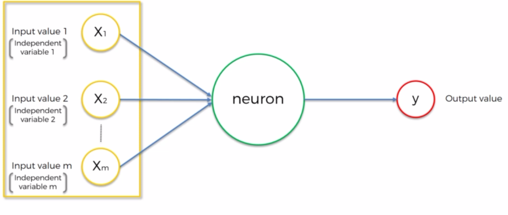
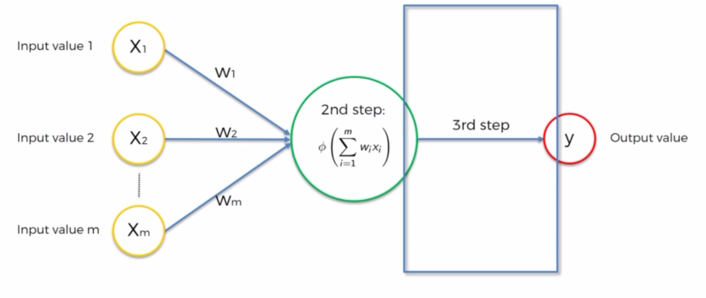
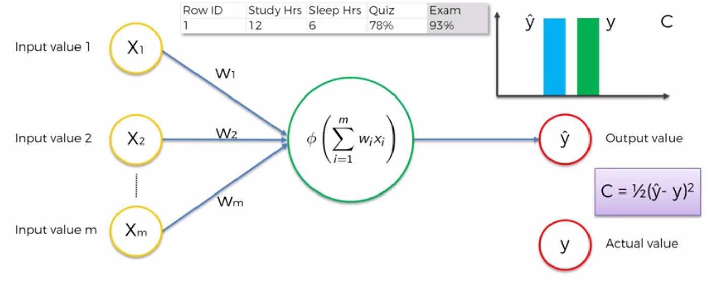

# Artificial Neural Networks

## Deep Learning


## Plan of attack

- Neuron
- Activation function
- How do Neural Networks works ?
- How do Neural Networks learn ?
- Gradient Descent
- Stochastic Gradient Descent
- Backpropagation

---

## Neuron


A neuron alone is useless, it needs to be connected with others thanks to the dendrite and axone. The connections is called the synapse.

So the neuron received input signals and send an output signal.


The input signals are more specifically input values and are collected by the brain thanks to sensors. The signal passe through synaps.

Input values are independent variable we need to standardize or normalize.



Output value can be continuous, binary or categorical (different values).


The synapse have weight which can be adjusted (using Gradient Descent and Backpropagation) to make the network more efficient.


Inside the neuron, all the input values and the weight are aggregated using a sum formula and will apply a function called __activation function__ to the aggregation.



This process is replicated in each neuron of each layer.

---

## Activation function

The are different types of activation function :

- Threshold Function


This simple function looks like a yes or no function.

- Sigmoid function


More complex function which is use in logistic regression and seems smoother. More useful for the ouput layer if you want to predict a probability.

- Rectifier function


Most popular activation function in artificial neural networks.

- Hyperbolic Tangent function 


Similar to the Sigmoïd function but start with y negative values.

 ### To go further 

[=> Activation functions](http://proceedings.mlr.press/v15/glorot11a/glorot11a.pdf) 

Let's take our previous example which is getting as an input binary variables. In this case, it make more sense to use threshold or sigmoid activation function.


If we take another example using an hidden layer. In this case we should use a Rectifier function for neurons in the hidden layer and a sigmoid for the output layer.


---

## How do neural networks work ?

Let's take an example with a already trained neural network which will extract properties of the picture below.


We have input parameters like Aera, bedrooms, distance to city, age ...
The varaibles will be weighted up and sent using a synapse to the output layer in order to calculate the price of the house (We could use different type of activation function : machine lerning algorithm, sigmoid ...).


To get more accurracy and efficiency using our neural network, we need to use neuros in the hidden layer to get this "extra-power".
Each synapse have a weight and some can be equal to 1 for example or 0: not all synapses get a weight bigger than 0, so some inputs will be more important than others.

For example, a neuron can specifically try to get only data about the area and distance from the city.


An other neuron can be specialised into other parameters : Aera, Bedrooms, Age because it could take as an hypothesis : " maybe in this aera big properties are old" , "the population demography has change and they want newer property". The neuron will combine these 3 parameters.


An other neuron can just take in account on parameter like Age because the older properties are less valuable but a really old one can be historical.


And the a neuron can pick up all parameters.


So this hidden layer allows us to increase the flexibility of the neural network and using different parameters combination at each neuron look to specific things.


All together neurons of the hidden layer will improve the accuracy of the prediction of our neural network.

---

## How do neural networks learn ?

You have to methods to help a machine to learn and give results or do actions:

- hard coding : code everything your program need to do 
- neural networks : give just the input and waiting for the output by letting the nn working.

Let's take an example with a simple neurol network using one layer.
We need to adjust the the ouput value to seperate this value (^y - predicted value) from the actual value (y - reality).


So when input values are sent into our neural network, we get a predicted output value and we need to compare this value with the actual value. We see that values are different if we plot them. Then we need to use a cost function (there are many types) to properly compare the actual and output value and return the error of the prediction.


After calculating the cost value, this information will be sent back to the neural network in order the update the weights. 


Our goal is to minimize our cost function by updating the weights.

So we will repeat these actions to get at the end the lowest cost value. 



If we trained our network using many rows at the same time (the example below just using one line to train the nn).

Each time we will train our neural network using all rows in the dataset we will make an __epoch__.

We will send each row as input values and compare the actual and predicted value by calculating the global cost value using a cost function


<br>


<br>


<br>


<br>


And when we finish our loop we go back to update the weights of our neural network (all the rows share the weight).


And we are repeating the process until we minimize the cost value.
This process use to adjust weights, it's called __back propagation__

### To go futher:  

[=> A list of cost functions used in neural networks, alongside applications](https://stats.stackexchange.com/questions/154879/a-list-of-cost-functions-used-in-neural-networks-alongside-applications)

---

## Gradient descent 

___How the weight are ajusted to minimize cost function return ?___

If we take a simple example and stay focused on one neuron in a layer which is getting a weighted input value and return a predicted value using an activation function. We will compare this predicted value with the actual by calculating the return of a cost function.


How can we minimize this return ?

One apporach is to plot the weights using the predicted value and cost return and choosing the best weight by taking the lower one.


This approach would work if you had one weight to adjust but with many of them we faced the __curse of dimensionality__.


Using this kind of approach will occur a very huge number combinaisons of weights which will too much and long to process.

So we have to use another method called __Gradient Descent__.

This method consists of watching the angle and slope for a cost return, if we plot weight using the cost and predicted value. That's will make move our points to the left or the right until we mimimize it.


<br>


<br>


<br>


<br>


<br>

__Example of 2D Gradient descent__


<br>

__Example of 3D Gradient descent__


---
## Stochastic Gradient descent 

If we use another cost function, we are not going to get a convex line after ploting the cost return and predicted value. So using a normal gradient descent method in this case won't help us to find the optimal weights to minimize the cost


The gradient descent take all rows to be applied and the stochastic gradient descent will take row one by one so we will adjust the weight several time.


This method is lighter and faster than the Batch gradient descent because it will process randomly row one by one.

There is another one call the __Mini Batch Gradient descent method__ which is a mixed of the Stochastic and normal one.

### To go futher:  

[=> A Neural Network in 13 lines of Python (Part 2 - Gradient Descent)](https://iamtrask.github.io/2015/07/27/python-network-part2/)

[=> Neural Networks and Deep Learning](http://neuralnetworksanddeeplearning.com/chap2.html)

## Backpropagation


Forward propagation is the method which propagate weighted signal from the neurons input layer to the output layer and then we calculated the errors using the predicted value.

<br>

Backpropagation is when we send back the errors to adjust the weights


The backpropagation is an advanced algorithm which allow us __all weights at the same time__.

### To go futher:  

[=> Neural Networks and Deep Learning](http://neuralnetworksanddeeplearning.com/chap2.html)


## Training the ANN with a Stochastic Gradient Descent


___


## Practical example

___

### Installation Tips

#### Installing Theano

Theano is an open source library for fast computations for GPU (graphics, more powerful) and CPU (your computer).

```bash
pip install --upgrade --no-deps git+git://github.com/Theano/Theano.git
```

#### Installing Tensorflow

Tensorflow is another open source library developped by Google Brain used to develop neural network from scratch.

[Install Tensorflow from the website](https://www.tensorflow.org/versions/r0.12/get_started/os_setup.html)

```bash
pip install tensorflow

```

#### Installing Keras

Open source library to build neural network using few lines or codes.

```bash
pip install --upgrade keras
```
___

## Dataset 

We are going to use a bank dataset with contains data of their customers. The company recently noticed a strange churn rate (when people leave the company) and want to understand the root case using different measures/variables : Surname, Credit score, Gender, Estimated Salary etc.

The company start to take the measure for a sample of the customers (about 10%) 6 month ago and now the column Exited says if the customer is still in the bank or not.

Our goal is to find geographic segmentation with the customers with the highest risk to leave.

---

## Data Processing

1. Importing librairies and the csv Dataset

2. Separate the features (dependent variables - X - from Geography -> Estimated Salary) and the independant variable (Y - Exited) by building matrix.

3. Encode categorical data (Geography and Gender) and create dummy variables because Geography contains 3 categories and Gender 2.

4. Splitting the dataset into the Training set and Test set

5. Apply feature scaling because there will be a lot of computations


```python
# Importing the libraries
import numpy as np
import matplotlib.pyplot as plt
import pandas as pd

# Importing the dataset
dataset = pd.read_csv('Churn_Modelling.csv')
dataset.head(5)
```


<div>
<style scoped>
    .dataframe tbody tr th:only-of-type {
        vertical-align: middle;
    }

    .dataframe tbody tr th {
        vertical-align: top;
    }

    .dataframe thead th {
        text-align: right;
    }
</style>
<table border="1" class="dataframe">
  <thead>
    <tr style="text-align: right;">
      <th></th>
      <th>RowNumber</th>
      <th>CustomerId</th>
      <th>Surname</th>
      <th>CreditScore</th>
      <th>Geography</th>
      <th>Gender</th>
      <th>Age</th>
      <th>Tenure</th>
      <th>Balance</th>
      <th>NumOfProducts</th>
      <th>HasCrCard</th>
      <th>IsActiveMember</th>
      <th>EstimatedSalary</th>
      <th>Exited</th>
    </tr>
  </thead>
  <tbody>
    <tr>
      <th>0</th>
      <td>1</td>
      <td>15634602</td>
      <td>Hargrave</td>
      <td>619</td>
      <td>France</td>
      <td>Female</td>
      <td>42</td>
      <td>2</td>
      <td>0.00</td>
      <td>1</td>
      <td>1</td>
      <td>1</td>
      <td>101348.88</td>
      <td>1</td>
    </tr>
    <tr>
      <th>1</th>
      <td>2</td>
      <td>15647311</td>
      <td>Hill</td>
      <td>608</td>
      <td>Spain</td>
      <td>Female</td>
      <td>41</td>
      <td>1</td>
      <td>83807.86</td>
      <td>1</td>
      <td>0</td>
      <td>1</td>
      <td>112542.58</td>
      <td>0</td>
    </tr>
    <tr>
      <th>2</th>
      <td>3</td>
      <td>15619304</td>
      <td>Onio</td>
      <td>502</td>
      <td>France</td>
      <td>Female</td>
      <td>42</td>
      <td>8</td>
      <td>159660.80</td>
      <td>3</td>
      <td>1</td>
      <td>0</td>
      <td>113931.57</td>
      <td>1</td>
    </tr>
    <tr>
      <th>3</th>
      <td>4</td>
      <td>15701354</td>
      <td>Boni</td>
      <td>699</td>
      <td>France</td>
      <td>Female</td>
      <td>39</td>
      <td>1</td>
      <td>0.00</td>
      <td>2</td>
      <td>0</td>
      <td>0</td>
      <td>93826.63</td>
      <td>0</td>
    </tr>
    <tr>
      <th>4</th>
      <td>5</td>
      <td>15737888</td>
      <td>Mitchell</td>
      <td>850</td>
      <td>Spain</td>
      <td>Female</td>
      <td>43</td>
      <td>2</td>
      <td>125510.82</td>
      <td>1</td>
      <td>1</td>
      <td>1</td>
      <td>79084.10</td>
      <td>0</td>
    </tr>
  </tbody>
</table>
</div>


```python
X = dataset.iloc[:, 3:13].values
y = dataset.iloc[:, 13].values

# Encoding categorical data
from sklearn.preprocessing import LabelEncoder, OneHotEncoder

# Geography variable
labelencoder_X_1 = LabelEncoder()
X[:, 1] = labelencoder_X_1.fit_transform(X[:, 1])
labelencoder_X_2 = LabelEncoder()

print("************ Encoding Geography **********")
print(X)

# Gender variable
X[:, 2] = labelencoder_X_2.fit_transform(X[:, 2])

print("************ Encoding Gender **********")
print(X)

# Create Dummy variables for Geography
onehotencoder = OneHotEncoder(categorical_features = [1])
X = onehotencoder.fit_transform(X).toarray()
X = X[:, 1:]

print("************ Create dummy variables **********")
print(X)

# Splitting the dataset into the Training set and Test set
from sklearn.model_selection import train_test_split
X_train, X_test, y_train, y_test = train_test_split(X, y, test_size = 0.2, random_state = 0)

print("************ Training set and Test set **********")
# Feature Scaling
from sklearn.preprocessing import StandardScaler
sc = StandardScaler()
X_train = sc.fit_transform(X_train)
X_test = sc.transform(X_test)

print("************ Feature Scaling **********")

```

    ************ Encoding Geography **********
    [[619 0 'Female' ... 1 1 101348.88]
     [608 2 'Female' ... 0 1 112542.58]
     [502 0 'Female' ... 1 0 113931.57]
     ...
     [709 0 'Female' ... 0 1 42085.58]
     [772 1 'Male' ... 1 0 92888.52]
     [792 0 'Female' ... 1 0 38190.78]]
    ************ Encoding Gender **********
    [[619 0 0 ... 1 1 101348.88]
     [608 2 0 ... 0 1 112542.58]
     [502 0 0 ... 1 0 113931.57]
     ...
     [709 0 0 ... 0 1 42085.58]
     [772 1 1 ... 1 0 92888.52]
     [792 0 0 ... 1 0 38190.78]]
    ************ Create dummy variables **********
    [[0.0000000e+00 0.0000000e+00 6.1900000e+02 ... 1.0000000e+00
      1.0000000e+00 1.0134888e+05]
     [0.0000000e+00 1.0000000e+00 6.0800000e+02 ... 0.0000000e+00
      1.0000000e+00 1.1254258e+05]
     [0.0000000e+00 0.0000000e+00 5.0200000e+02 ... 1.0000000e+00
      0.0000000e+00 1.1393157e+05]
     ...
     [0.0000000e+00 0.0000000e+00 7.0900000e+02 ... 0.0000000e+00
      1.0000000e+00 4.2085580e+04]
     [1.0000000e+00 0.0000000e+00 7.7200000e+02 ... 1.0000000e+00
      0.0000000e+00 9.2888520e+04]
     [0.0000000e+00 0.0000000e+00 7.9200000e+02 ... 1.0000000e+00
      0.0000000e+00 3.8190780e+04]]
    ************ Training set and Test set **********
    ************ Feature Scaling **********


    /usr/local/lib/python3.7/site-packages/sklearn/preprocessing/_encoders.py:363: FutureWarning: The handling of integer data will change in version 0.22. Currently, the categories are determined based on the range [0, max(values)], while in the future they will be determined based on the unique values.
    If you want the future behaviour and silence this warning, you can specify "categories='auto'".
    In case you used a LabelEncoder before this OneHotEncoder to convert the categories to integers, then you can now use the OneHotEncoder directly.
      warnings.warn(msg, FutureWarning)
    /usr/local/lib/python3.7/site-packages/sklearn/preprocessing/_encoders.py:385: DeprecationWarning: The 'categorical_features' keyword is deprecated in version 0.20 and will be removed in 0.22. You can use the ColumnTransformer instead.
      "use the ColumnTransformer instead.", DeprecationWarning)


---

## Building ANN


### 1 - Importing Librairies

```python
# Importing the Keras libraries and packages
import keras

# Initialize the model
from keras.models import Sequential

# Build Layers
from keras.layers import Dense

# Tensorflow backend 
from tensorflow.keras import backend

```
### 2 - Initialising Artificial Neural Networks

```python
# Initialising the ANN
classifier = Sequential()
```
### 3 - Adding the Input Layer and first hidden layer

__parameters:__

- `input_dim` : The number of nodes in the input layer is the number of the independant variables -> __11__.

- `output_dim` : The number of nodes in the ouput layer is the average number of the independant variables of both layers:  11  / 2 -> __6__.

- `activation` : activation function , we are using the __rectifier (relu)__

- `init`: the __uniform__ value make sure that weights are uniformly and randomly distributed.


```python
# Adding the input layer and the first hidden layer 
classifier.add(Dense(output_dim = 6, init = 'uniform', activation = 'relu', input_dim = 11))
```
### 4 - Adding the second hidden layer

__parameters:__

- `output_dim` : The number of nodes in the ouput layer is the average number of the independant variables of both layers:  11  / 2 -> __6__.

- `activation` : activation function , we are using the __rectifier (relu)__

- `init`: the __uniform__ value make sure that weights are uniformly and randomly distributed.

```python
classifier.add(Dense(output_dim = 6, init = 'uniform', activation = 'relu'))
```

### 5 - Adding the output layer

__parameters:__

- `output_dim` : we only want a single result for our output layer -> __1__.

- `activation` : in this case,  we are using the __sigmoid__ function because we want a probability as a result.
PS: use the `soft_max` function if you have more than 2 categories.

- `init`: the __uniform__ value make sure that weights are uniformly and randomly distributed.

```python
classifier.add(Dense(output_dim = 1, init = 'uniform', activation = 'sigmoid'))
```

### 6 - Compiling the ANN

__parameters:__

- `optimizer`: the optimizer is the algorithm you want to use to find the optimal set of weights in the neural networks. We are going to use the __Adam__ algo which is a __efficient type of Sochastic Gradient descent algorithm__

- `loss`: the loss is the loss function used with the Sochastic Grandient descent algorithm : logarithmic loss function -> __binary_crossentropy__ because we have a binary outcome (we shoud use categorical_crossentropy if we had more results for the outcome).


- `metrics`: criterium used by the algorithm to improve the model performance : __accuracy__.


```python
classifier.compile(optimizer = 'adam', loss = 'binary_crossentropy', metrics = ['accuracy'])
```

### 7 - Fitting the ANN to the Training set

__parameters:__

- `batch_size`: Number of rows

- `nb_epoch`: Number of epochs

```python
classifier.fit(X_train, y_train, batch_size = 10, nb_epoch = 100)
```

---

### Full code


```python
# Importing the Keras libraries and packages
import keras

# Initialize the model
from keras.models import Sequential

# Build Layers
from keras.layers import Dense

# Tensorflow backend 
from tensorflow.keras import backend

# Initialising the ANN
classifier = Sequential()

# Adding the input layer and the first hidden layer 
# 11 input node because of the 11 independent variable
# Use rectifier activation function
classifier.add(Dense(output_dim = 6, init = 'uniform', activation = 'relu', input_dim = 11))

# Adding the second hidden layer
# Use rectifier activation function
classifier.add(Dense(output_dim = 6, init = 'uniform', activation = 'relu'))

# Adding the output layer
# Use sigmoïd activation function
classifier.add(Dense(output_dim = 1, init = 'uniform', activation = 'sigmoid'))

# Compiling the ANN
classifier.compile(optimizer = 'adam', loss = 'binary_crossentropy', metrics = ['accuracy'])

# Fitting the ANN to the Training set
classifier.fit(X_train, y_train, batch_size = 10, nb_epoch = 100)
```

    Using TensorFlow backend.


    WARNING:tensorflow:From /usr/local/lib/python3.7/site-packages/tensorflow/python/framework/op_def_library.py:263: colocate_with (from tensorflow.python.framework.ops) is deprecated and will be removed in a future version.
    Instructions for updating:
    Colocations handled automatically by placer.
    WARNING:tensorflow:From /usr/local/lib/python3.7/site-packages/tensorflow/python/ops/math_ops.py:3066: to_int32 (from tensorflow.python.ops.math_ops) is deprecated and will be removed in a future version.
    Instructions for updating:
    Use tf.cast instead.


    /usr/local/lib/python3.7/site-packages/ipykernel_launcher.py:19: UserWarning: Update your `Dense` call to the Keras 2 API: `Dense(activation="relu", input_dim=11, units=6, kernel_initializer="uniform")`
    /usr/local/lib/python3.7/site-packages/ipykernel_launcher.py:23: UserWarning: Update your `Dense` call to the Keras 2 API: `Dense(activation="relu", units=6, kernel_initializer="uniform")`
    /usr/local/lib/python3.7/site-packages/ipykernel_launcher.py:27: UserWarning: Update your `Dense` call to the Keras 2 API: `Dense(activation="sigmoid", units=1, kernel_initializer="uniform")`
    /usr/local/lib/python3.7/site-packages/ipykernel_launcher.py:33: UserWarning: The `nb_epoch` argument in `fit` has been renamed `epochs`.


    Epoch 1/100
    8000/8000 [==============================] - 1s 140us/step - loss: 0.4903 - acc: 0.7955
    Epoch 2/100
    8000/8000 [==============================] - 1s 97us/step - loss: 0.4265 - acc: 0.7960
    Epoch 3/100
    8000/8000 [==============================] - 1s 96us/step - loss: 0.4220 - acc: 0.7960
    Epoch 4/100
    8000/8000 [==============================] - 1s 96us/step - loss: 0.4188 - acc: 0.8189
    Epoch 5/100
    8000/8000 [==============================] - 1s 108us/step - loss: 0.4167 - acc: 0.8259
    Epoch 6/100
    8000/8000 [==============================] - 1s 100us/step - loss: 0.4148 - acc: 0.8287
    Epoch 7/100
    8000/8000 [==============================] - 1s 97us/step - loss: 0.4132 - acc: 0.8296
    Epoch 8/100
    8000/8000 [==============================] - 1s 98us/step - loss: 0.4119 - acc: 0.8297
    Epoch 9/100
    8000/8000 [==============================] - 1s 103us/step - loss: 0.4108 - acc: 0.8321
    Epoch 10/100
    8000/8000 [==============================] - 1s 97us/step - loss: 0.4096 - acc: 0.8337
    Epoch 11/100
    8000/8000 [==============================] - 1s 98us/step - loss: 0.4091 - acc: 0.8336
    Epoch 12/100
    8000/8000 [==============================] - 1s 97us/step - loss: 0.4083 - acc: 0.8325
    Epoch 13/100
    8000/8000 [==============================] - 1s 96us/step - loss: 0.4078 - acc: 0.8331
    Epoch 14/100
    8000/8000 [==============================] - 1s 100us/step - loss: 0.4070 - acc: 0.8345
    Epoch 15/100
    8000/8000 [==============================] - 1s 101us/step - loss: 0.4067 - acc: 0.8347
    Epoch 16/100
    8000/8000 [==============================] - 1s 98us/step - loss: 0.4064 - acc: 0.8360
    Epoch 17/100
    8000/8000 [==============================] - 1s 97us/step - loss: 0.4050 - acc: 0.8334
    Epoch 18/100
    8000/8000 [==============================] - 1s 98us/step - loss: 0.4055 - acc: 0.8347
    Epoch 19/100
    8000/8000 [==============================] - 1s 98us/step - loss: 0.4050 - acc: 0.8330
    Epoch 20/100
    8000/8000 [==============================] - 1s 97us/step - loss: 0.4044 - acc: 0.8347
    Epoch 21/100
    8000/8000 [==============================] - 1s 98us/step - loss: 0.4042 - acc: 0.8339
    Epoch 22/100
    8000/8000 [==============================] - 1s 99us/step - loss: 0.4042 - acc: 0.8339
    Epoch 23/100
    8000/8000 [==============================] - 1s 97us/step - loss: 0.4036 - acc: 0.8349
    Epoch 24/100
    8000/8000 [==============================] - 1s 99us/step - loss: 0.4034 - acc: 0.8346
    Epoch 25/100
    8000/8000 [==============================] - 1s 96us/step - loss: 0.4029 - acc: 0.8340
    Epoch 26/100
    8000/8000 [==============================] - 1s 96us/step - loss: 0.4028 - acc: 0.8364
    Epoch 27/100
    8000/8000 [==============================] - 1s 98us/step - loss: 0.4027 - acc: 0.8345
    Epoch 28/100
    8000/8000 [==============================] - 1s 97us/step - loss: 0.4028 - acc: 0.8346
    Epoch 29/100
    8000/8000 [==============================] - 1s 98us/step - loss: 0.4024 - acc: 0.8340
    Epoch 30/100
    8000/8000 [==============================] - 1s 97us/step - loss: 0.4025 - acc: 0.8359
    Epoch 31/100
    8000/8000 [==============================] - 1s 98us/step - loss: 0.4020 - acc: 0.8365
    Epoch 32/100
    8000/8000 [==============================] - 1s 99us/step - loss: 0.4022 - acc: 0.8342
    Epoch 33/100
    8000/8000 [==============================] - 1s 101us/step - loss: 0.4017 - acc: 0.8350
    Epoch 34/100
    8000/8000 [==============================] - 1s 102us/step - loss: 0.4023 - acc: 0.8339
    Epoch 35/100
    8000/8000 [==============================] - 1s 103us/step - loss: 0.4015 - acc: 0.8336
    Epoch 36/100
    8000/8000 [==============================] - 1s 101us/step - loss: 0.4017 - acc: 0.8355
    Epoch 37/100
    8000/8000 [==============================] - 1s 110us/step - loss: 0.4016 - acc: 0.8350
    Epoch 38/100
    8000/8000 [==============================] - 1s 108us/step - loss: 0.4015 - acc: 0.8357
    Epoch 39/100
    8000/8000 [==============================] - 1s 105us/step - loss: 0.4016 - acc: 0.8360
    Epoch 40/100
    8000/8000 [==============================] - 1s 104us/step - loss: 0.4013 - acc: 0.8352
    Epoch 41/100
    8000/8000 [==============================] - 1s 103us/step - loss: 0.4016 - acc: 0.8347
    Epoch 42/100
    8000/8000 [==============================] - 1s 102us/step - loss: 0.4013 - acc: 0.8349
    Epoch 43/100
    8000/8000 [==============================] - 1s 100us/step - loss: 0.4009 - acc: 0.8361
    Epoch 44/100
    8000/8000 [==============================] - 1s 102us/step - loss: 0.4011 - acc: 0.8331
    Epoch 45/100
    8000/8000 [==============================] - 1s 102us/step - loss: 0.4009 - acc: 0.8351
    Epoch 46/100
    8000/8000 [==============================] - 1s 100us/step - loss: 0.4010 - acc: 0.8346
    Epoch 47/100
    8000/8000 [==============================] - 1s 102us/step - loss: 0.4014 - acc: 0.8341
    Epoch 48/100
    8000/8000 [==============================] - 1s 105us/step - loss: 0.4005 - acc: 0.8346
    Epoch 49/100
    8000/8000 [==============================] - 1s 105us/step - loss: 0.4011 - acc: 0.8354
    Epoch 50/100
    8000/8000 [==============================] - 1s 104us/step - loss: 0.4010 - acc: 0.8345
    Epoch 51/100
    8000/8000 [==============================] - 1s 105us/step - loss: 0.4007 - acc: 0.8354
    Epoch 52/100
    8000/8000 [==============================] - 1s 105us/step - loss: 0.4008 - acc: 0.8354
    Epoch 53/100
    8000/8000 [==============================] - 1s 106us/step - loss: 0.4008 - acc: 0.8347
    Epoch 54/100
    8000/8000 [==============================] - 1s 102us/step - loss: 0.4005 - acc: 0.8342
    Epoch 55/100
    8000/8000 [==============================] - 1s 103us/step - loss: 0.4013 - acc: 0.8344
    Epoch 56/100
    8000/8000 [==============================] - 1s 101us/step - loss: 0.4007 - acc: 0.8352
    Epoch 57/100
    8000/8000 [==============================] - 1s 103us/step - loss: 0.4009 - acc: 0.8347
    Epoch 58/100
    8000/8000 [==============================] - 1s 105us/step - loss: 0.4007 - acc: 0.8337
    Epoch 59/100
    8000/8000 [==============================] - 1s 104us/step - loss: 0.4005 - acc: 0.8339
    Epoch 60/100
    8000/8000 [==============================] - 1s 104us/step - loss: 0.4007 - acc: 0.8337
    Epoch 61/100
    8000/8000 [==============================] - 1s 99us/step - loss: 0.4009 - acc: 0.8357
    Epoch 62/100
    8000/8000 [==============================] - 1s 100us/step - loss: 0.4007 - acc: 0.8346
    Epoch 63/100
    8000/8000 [==============================] - 1s 98us/step - loss: 0.4007 - acc: 0.8347
    Epoch 64/100
    8000/8000 [==============================] - 1s 99us/step - loss: 0.4001 - acc: 0.8346
    Epoch 65/100
    8000/8000 [==============================] - 1s 97us/step - loss: 0.4008 - acc: 0.8347
    Epoch 66/100
    8000/8000 [==============================] - 1s 99us/step - loss: 0.4006 - acc: 0.8352
    Epoch 67/100
    8000/8000 [==============================] - 1s 97us/step - loss: 0.4006 - acc: 0.8354
    Epoch 68/100
    8000/8000 [==============================] - 1s 98us/step - loss: 0.4003 - acc: 0.8346
    Epoch 69/100
    8000/8000 [==============================] - 1s 101us/step - loss: 0.4003 - acc: 0.8350
    Epoch 70/100
    8000/8000 [==============================] - 1s 101us/step - loss: 0.4006 - acc: 0.8354
    Epoch 71/100
    8000/8000 [==============================] - 1s 100us/step - loss: 0.4006 - acc: 0.8355
    Epoch 72/100
    8000/8000 [==============================] - 1s 102us/step - loss: 0.4003 - acc: 0.8350
    Epoch 73/100
    8000/8000 [==============================] - 1s 101us/step - loss: 0.4001 - acc: 0.8350
    Epoch 74/100
    8000/8000 [==============================] - 1s 102us/step - loss: 0.4001 - acc: 0.8351
    Epoch 75/100
    8000/8000 [==============================] - 1s 98us/step - loss: 0.4006 - acc: 0.8364
    Epoch 76/100
    8000/8000 [==============================] - 1s 97us/step - loss: 0.4001 - acc: 0.8356
    Epoch 77/100
    8000/8000 [==============================] - 1s 98us/step - loss: 0.4005 - acc: 0.8351
    Epoch 78/100
    8000/8000 [==============================] - 1s 98us/step - loss: 0.4003 - acc: 0.8352
    Epoch 79/100
    8000/8000 [==============================] - 1s 99us/step - loss: 0.4003 - acc: 0.8354
    Epoch 80/100
    8000/8000 [==============================] - 1s 103us/step - loss: 0.4002 - acc: 0.8352
    Epoch 81/100
    8000/8000 [==============================] - 1s 106us/step - loss: 0.4006 - acc: 0.8345
    Epoch 82/100
    8000/8000 [==============================] - 1s 102us/step - loss: 0.4002 - acc: 0.8337
    Epoch 83/100
    8000/8000 [==============================] - 1s 102us/step - loss: 0.3998 - acc: 0.8354
    Epoch 84/100
    8000/8000 [==============================] - 1s 102us/step - loss: 0.4004 - acc: 0.8344
    Epoch 85/100
    8000/8000 [==============================] - 1s 101us/step - loss: 0.4004 - acc: 0.8356
    Epoch 86/100
    8000/8000 [==============================] - 1s 101us/step - loss: 0.4003 - acc: 0.8349
    Epoch 87/100
    8000/8000 [==============================] - 1s 103us/step - loss: 0.4001 - acc: 0.8366
    Epoch 88/100
    8000/8000 [==============================] - 1s 102us/step - loss: 0.4002 - acc: 0.8356
    Epoch 89/100
    8000/8000 [==============================] - 1s 102us/step - loss: 0.4003 - acc: 0.8356
    Epoch 90/100
    8000/8000 [==============================] - 1s 104us/step - loss: 0.3998 - acc: 0.8357
    Epoch 91/100
    8000/8000 [==============================] - 1s 101us/step - loss: 0.4000 - acc: 0.8351
    Epoch 92/100
    8000/8000 [==============================] - 1s 103us/step - loss: 0.4004 - acc: 0.8354
    Epoch 93/100
    8000/8000 [==============================] - 1s 102us/step - loss: 0.3999 - acc: 0.8347
    Epoch 94/100
    8000/8000 [==============================] - 1s 102us/step - loss: 0.4003 - acc: 0.8352
    Epoch 95/100
    8000/8000 [==============================] - 1s 102us/step - loss: 0.4003 - acc: 0.8346
    Epoch 96/100
    8000/8000 [==============================] - 1s 102us/step - loss: 0.4001 - acc: 0.8360
    Epoch 97/100
    8000/8000 [==============================] - 1s 103us/step - loss: 0.4002 - acc: 0.8347
    Epoch 98/100
    8000/8000 [==============================] - 1s 102us/step - loss: 0.4003 - acc: 0.8356
    Epoch 99/100
    8000/8000 [==============================] - 1s 103us/step - loss: 0.3999 - acc: 0.8351
    Epoch 100/100
    8000/8000 [==============================] - 1s 101us/step - loss: 0.4001 - acc: 0.8357


    <keras.callbacks.History at 0x124b7df28>


## Making the predictions and evaluating the model


```python
# Predicting the Test set results
y_pred = classifier.predict(X_test)
print(y_pred)

# Need to convert probabilities to Boolean values 
# We need take the standard 50% threshold 
y_pred = (y_pred > 0.5)

y_pred
```

    [[0.17421031]
     [0.3468189 ]
     [0.13791767]
     ...
     [0.2021403 ]
     [0.14789769]
     [0.11822695]]


    array([[False],
           [False],
           [False],
           ...,
           [False],
           [False],
           [False]])


```python
# Making the Confusion Matrix
from sklearn.metrics import confusion_matrix
cm = confusion_matrix(y_test, y_pred)
cm
```


    array([[1540,   55],
           [ 265,  140]])


We got 1540 + 140 correct predictions -> 83% !!


```python

```
